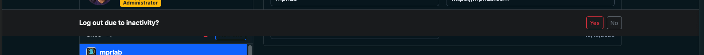

# ISSUES (Append-only section-based log)

Entries record newly discovered requests or changes, with their outcomes. No instructive content lives here. Read @NOTES.md for the process to follow when fixing issues.

Read @AGENTS.md, @ARCHITECTURE.md, @README.md, @PRD.md. Read @POLICY.md, PLANNING.md, @NOTES.md, and @ISSUES.md under issues.md/.  Start working on open issues. Work autonomously and stack up PRs. Prioritize bugfixes.

Each issue is formatted as `- [ ] [LA-<number>]`. When resolved it becomes `- [x] [LA-<number>]`.

## Features (113–199)

## BugFixes (312–399)

- [x] [LA-318] Theme toggle defaults and mapping are wrong (left = light, right = dark).
  Priority: P0
  Goal: The left toggle state represents light theme, the right state represents dark theme, and the initial UI state matches the applied theme.
  Deliverable: PR that fixes theme toggle behavior across landing, dashboard, and public pages; automated coverage updated.
  Resolution: Reordered `mpr-footer` theme modes to `light` then `dark` and added headless integration coverage for landing/privacy/dashboard toggle state + applied theme.
  Docs/Refs:
  - `issues.md/AGENTS.FRONTEND.md`
  - `internal/httpapi/footer.go`
  - `internal/httpapi/templates/dashboard.tmpl`
  - `internal/httpapi/public_assets.go`
  Execution plan:
  - Identify the single source of truth for theme mode (document attribute + storage key).
  - Fix toggle UI state mapping (mpr-ui footer event + local storage + `data-bs-theme`).
  - Add/adjust integration assertions around theme attribute and toggle state.

- [x] [LA-317] mpr-ui footer menu label “Built by Marco Polo Research Lab” is invisible.
  Priority: P1
  Goal: Footer label is visible in both light and dark themes and matches the mpr-ui demo styling.
  Deliverable: PR that removes/adjusts conflicting CSS and validates footer label visibility; screenshot-based evidence if needed.
  Resolution: Stop passing `toggle-button-id` so mpr-ui can populate the footer menu button label/classes, and synchronize `data-mpr-theme` with `data-bs-theme` so light-mode tokens apply; added headless integration coverage for computed label color.
  Docs/Refs:
  - `tools/mpr-ui/demo/index.html`
  - `internal/httpapi/templates/dashboard.tmpl`
  - `internal/httpapi/public_assets.go`
  Execution plan:
  - Compare LoopAware footer DOM/CSS against the mpr-ui demo.
  - Identify overriding selectors in LoopAware CSS (especially for footer text colors).
  - Adjust styles to avoid clobbering mpr-ui defaults; verify both themes.

- [x] [LA-319] Additional subscribe origins may not persist/display after saving and returning to the site editor.
  Priority: P1
  Goal: When operators add additional subscribe origins, save the site, and later re-open the same site in the dashboard, the saved origins are shown in the “Additional subscribe origins” editor.
  Deliverable: PR with a reproducible failing test + fix (or documented repro steps if environment-specific).
  Notes: Reported behavior is “added origins do not appear after returning to the site”; confirm whether the operator clicked Save, and whether the dashboard was refreshed or the site was re-selected without a reload.
  Resolution: Unable to reproduce after verifying persistence/rehydration coverage for subscribe origins.
  Docs/Refs:
  - `internal/httpapi/templates/dashboard.tmpl`
  - `internal/httpapi/admin.go` (site responses)
  - `internal/httpapi/subscribe_allowed_origins_dashboard_integration_test.go`

- [x] [LA-320] Login loop between `/login` and `/app` when TAuth session cookie name is customized.
  Priority: P0
  Goal: Dashboard loads after successful TAuth login; LoopAware validates the configured session cookie name.
  Deliverable: PR that passes the TAuth session cookie name into the validator and updates env/docs.
  Notes: LoopAware currently assumes `app_session`; TAuth tenant uses `app_session_loopaware`.
  Resolution: Added `TAUTH_SESSION_COOKIE_NAME` config/flag, wired it into session validation, and updated env samples/docs plus config-audit.
  Docs/Refs:
  - `cmd/server/main.go`
  - `internal/httpapi/auth.go`
  - `configs/.env.loopaware`

- [x] [LA-321] Logout should redirect to the landing page from authenticated views.
  Priority: P1
  Goal: After logging out via the header, the dashboard (and related authenticated pages) return to `/login`.
  Deliverable: PR that redirects on `mpr-ui:auth:unauthenticated` when configured on dashboard headers.
  Resolution: Added a logout-redirect flag to dashboard headers and routed unauthenticated events back to the landing path.
  Docs/Refs:
  - `internal/httpapi/public_assets.go`
  - `internal/httpapi/templates/dashboard_header.tmpl`

- [x] [LA-322] Landing theme preference does not persist to the dashboard after login.
  Priority: P1
  Goal: When no explicit theme is stored, the landing theme persists to localStorage and the dashboard uses it after login.
  Deliverable: PR that persists the landing default theme and adds integration coverage for landing-to-dashboard theme propagation.
  Notes: Landing defaults to dark without persisting; dashboard defaults to light when no preference exists.
  Resolution: Persisted landing default theme on boot and added integration coverage for landing-default propagation into the dashboard.
  Docs/Refs:
  - `internal/httpapi/public_assets.go`
  - `internal/httpapi/dashboard_integration_test.go`
  - `internal/httpapi/templates/dashboard.tmpl`

- [x] [LA-323] Dashboard header profile menu regressed to oversized buttons after TAuth migration.
  Priority: P1
  Goal: Restore the avatar dropdown with account settings and logout while keeping TAuth-backed authentication.
  Deliverable: PR that renders the profile dropdown and updates integration coverage for opening the settings modal.
  Notes: The header currently shows separate large buttons instead of a compact dropdown menu.
  Resolution: Reintroduced a compact avatar dropdown in the dashboard header, hid the built-in header actions, added dropdown open fallbacks, and updated integration coverage to open the menu before clicking settings; `make ci` passes.
  Docs/Refs:
  - `internal/httpapi/public_assets.go`
  - `internal/httpapi/templates/dashboard_header.tmpl`
  - `internal/httpapi/templates/dashboard.tmpl`
  - `internal/httpapi/dashboard_integration_test.go`

- [x] [LA-324] Landing page does not redirect to the dashboard after successful TAuth login.
  Priority: P0
  Goal: When a user authenticates via TAuth, the landing page should redirect them to `/app` once the header is authenticated.
  Deliverable: PR that detects already-authenticated header state on boot, redirects to the dashboard, and adds integration coverage.
  Notes: The header shows the logged-in user, but no navigation occurs.
  Resolution: Avoided HTML-escaped `<` in the auth script loop, added a `getCurrentUser` bootstrap fallback, and tightened the landing redirect integration assertions; `make ci` passes.
  Docs/Refs:
  - `internal/httpapi/public_assets.go`
  - `internal/httpapi/templates/landing.tmpl`
  - `internal/httpapi/landing.go`
  - `internal/httpapi/dashboard_integration_test.go`

- [x] [LA-325] Logout does not clear the TAuth session from the dashboard header.
  Priority: P0
  Goal: Clicking Logout clears the TAuth session cookie and returns the user to `/login`, with the header showing unauthenticated state on reload.
  Deliverable: PR that wires the custom dropdown logout to the same auth/logout path as mpr-ui (or TAuth), with integration coverage for logout + redirect.
  Notes: The custom menu uses `public_assets.go` `handleLogout` → `window.logout` fallback; if `tauth.js` is missing/mis-wired, we redirect without invalidating the session. Confirm the logout helper includes `X-TAuth-Tenant` and correct `tauth-url`. If the issue is in `tauth.js` or mpr-ui auth helpers, note/update those repos.
  Resolution: Always issue a direct `/auth/logout` POST after `window.logout` (tauth.js swallows errors), plus logout integration coverage that asserts the logout request and landing redirect; `make ci` passes.
  Docs/Refs:
  - `internal/httpapi/public_assets.go`
  - `internal/httpapi/templates/dashboard_header.tmpl`
  - `tools/mpr-ui/docs/custom-elements.md`
  - `tools/TAuth/docs/migration.md`

- [x] [LA-326] Account settings modal opens blank from the header dropdown.
  Priority: P1
  Goal: The Account settings action opens a modal with the expected auto-logout controls and descriptive copy across both themes.
  Deliverable: PR that ensures the modal renders content and remains readable in both light/dark modes; add integration coverage for settings modal visibility + content.
  Notes: The menu item targets `SettingsModalID`, but users report an empty modal. Verify Bootstrap modal wiring, `SettingsModalID` parity between `dashboard_header.tmpl` and `dashboard.tmpl`, and theme styling that could render content invisible. Consider migrating to `<mpr-settings>` if the modal is brittle.
  Resolution: Bound the dropdown settings action to open the Bootstrap modal directly from the custom profile menu and added integration coverage that asserts modal content text + contrast; `make ci` passes.
  Docs/Refs:
  - `internal/httpapi/templates/dashboard_header.tmpl`
  - `internal/httpapi/templates/dashboard.tmpl`
  - `internal/httpapi/web.go`

- [x] [LA-327] Dashboard header/footer palette is out of sync with body theme.
  Priority: P1
  Goal: Header, footer, and body share the same light/dark palette so the UI feels cohesive in both themes.
  Deliverable: PR that aligns mpr-ui theme tokens with Bootstrap theme state (or documents a new preset) and adds integration coverage for theme consistency.
  Notes: Landing page overrides `--mpr-color-*` tokens, but dashboard does not. mpr-ui uses its own CSS variables keyed off `data-mpr-theme`, while the dashboard applies Bootstrap classes; the palettes can diverge. If a shared preset or `data-bs-theme` integration belongs in mpr-ui, note it for that repo.
  Resolution: Bind Bootstrap body color variables to mpr-ui theme tokens and drop conflicting body bg classes, plus new integration coverage comparing header/footer palette deltas against the body in light/dark modes; `make ci` passes.
  Docs/Refs:
  - `internal/httpapi/templates/dashboard.tmpl`
  - `internal/httpapi/public_assets.go`
  - `tools/mpr-ui/README.md`

- [x] [LA-328] Dashboard header profile toggle should be avatar-only with dropdown actions.
  Priority: P1
  Goal: The header shows a single avatar (no wide name button) that opens the settings/logout dropdown; display name can appear inside the menu.
  Deliverable: PR that adjusts header markup/CSS and updates profile name injection logic to render inside the dropdown instead of the toggle.
  Notes: `dashboard_header.tmpl` currently renders the name inside the toggle button, producing a large pill button. Update the template and `public_assets.go` profile sync to support the compact avatar-only toggle.
  Resolution: Moved the display name into the dropdown, rendered an avatar-only toggle with updated header styling and profile sync attributes, and added integration coverage for avatar-only toggle/menu display; landing auth harness now stubs mpr-ui auth bootstrap to keep redirect checks stable; `make ci` passes.
  Docs/Refs:
  - `internal/httpapi/templates/dashboard_header.tmpl`
  - `internal/httpapi/templates/dashboard.tmpl`
  - `internal/httpapi/public_assets.go`
  - `internal/httpapi/dashboard_integration_test.go`

- [x] [LA-329] Logout button does not terminate the session after the header refactor.
  Priority: P1
  Goal: Clicking Logout clears the TAuth session and returns the user to the landing page without re-authentication loops.
  Deliverable: PR that hardens the logout flow against helper/fetch failures and adds integration coverage for the fallback behavior.
  Notes: Regression observed after the header dropdown refactor; logout should still work even when the TAuth helper or fetch path fails (e.g., transient CORS issues). If the fix needs a TAuth change, document it here.
  Resolution: Added a form-post fallback when both `window.logout` and the fetch path fail, and added integration coverage that forces both failures and verifies the fallback + redirect; `make ci` passes.
  Docs/Refs:
  - `internal/httpapi/public_assets.go`
  - `internal/httpapi/dashboard_integration_test.go`

- [x] [LA-330] Header dropdown actions are unresponsive in some sessions.
  Priority: P1
  Goal: Settings and logout reliably bind even when the header renders late or auth attributes update before slot content mounts.
  Deliverable: PR that retries custom profile binding and resolves logout endpoints from tauth.js when available, plus coverage if possible.
  Notes: Users report the settings modal and logout action do nothing; likely the custom menu handlers never attach or the logout request targets the wrong origin.
  Resolution: Added retry logic for custom profile binding, made logout prefer tauth.js `getAuthEndpoints()` when available, and relaxed settings click handling so Bootstrap’s data API still works when manual modal control is unavailable; `make ci` passes.
  Docs/Refs:
  - `internal/httpapi/public_assets.go`
  - `internal/httpapi/dashboard_integration_test.go`

- [x] [LA-331] Remove auth fallbacks and rely solely on mpr-ui auth events.
  Priority: P1
  Goal: Login/logout announcements and redirects are driven only by `mpr-ui:auth:*` events, without MutationObserver or manual bootstrap fallbacks.
  Deliverable: PR that removes attribute/observer fallbacks and confirms event-driven redirects still work.
  Notes: Required to align with mpr-ui integration guidance and avoid double-trigger behavior.
  Resolution: Removed attribute observers/bootstraps, and now dispatches `mpr-ui:auth:authenticated` when dashboard user data loads so the header updates via events only; `make ci` passes.
  Docs/Refs:
  - `internal/httpapi/public_assets.go`
  - `internal/httpapi/templates/dashboard.tmpl`

- [x] [LA-332]  The logout notification is floating in space instead of being sticky to the bottom of the screen
  Priority: P1
  Goal: Session timeout notification is fixed to the bottom edge of the viewport.
  Deliverable: PR that pins the timeout notification to the bottom and adds integration coverage for its position.
  Resolution: Added bottom anchoring to the timeout banner and integration coverage asserting its bottom alignment.
- [x] [LA-333] Safari header dropdown actions are unresponsive after auth.
  Priority: P1
  Goal: Avatar dropdown opens and settings/logout clicks work on Safari without missing bindings.
  Deliverable: PR that makes header menu bindings resilient to mpr-ui re-renders; update tests if feasible.
  Notes: Safari appears to drop or never attach the click handlers on the avatar menu items, so no logout request is sent and the settings modal never opens.
  Resolution: Switched auth script rendering to a text template to prevent HTML escaping in JS, and added delegated profile menu click handling to keep settings/logout responsive across browsers; `make ci` passes.
  Docs/Refs:
  - `internal/httpapi/public_assets.go`
  - `internal/httpapi/templates/dashboard_header.tmpl`
  - `tools/mpr-ui/docs/custom-elements.md`

- [x] [LA-334] Logout occurs much faster than the configured timeout.
  Priority: P1
  Goal: Authentication sessions honor the configured timeout before forcing logout.
  Deliverable: PR that identifies the premature logout trigger, aligns the effective timeout with configuration, and adds/updates integration coverage for session duration.
  Notes: Reported behavior indicates logout occurs significantly earlier than the configured session timeout; confirm whether this is driven by the dashboard inactivity timer vs. server/TAuth session expiry.
  Resolution: Added configurable session timeout prompt/logout durations and integration coverage to assert the dashboard defaults honor the configured values; `make ci` passes.

- [x] [LA-335] Google Sign-In auto-suggests login after a timed-out logout.
  Priority: P1
  Goal: After an inactivity-triggered logout, Google Sign-In should not immediately prompt or auto-suggest login without user action.
  Deliverable: PR that suppresses auto-prompt/auto-select behavior after timeout-driven logout and adds integration coverage for the post-timeout login UX.
  Notes: Observed behavior is a Google Sign-In prompt immediately after timeout logout; confirm whether GIS auto-select or mpr-ui auth bootstrap is responsible and ensure the prompt only appears on explicit user intent.
  Resolution: Disabled Google auto-select during timeout-driven logout and added integration coverage to verify the suppression; `make ci` passes.

- [x] [LA-336] Additional subscribe origins disappear after logout/login.
  Priority: P1
  Goal: Additional subscribe origins remain visible in the dashboard editor after a logout/login cycle and are enforced by the backend.
  Deliverable: PR that persists and rehydrates additional subscribe origins in the UI after re-auth and adds coverage for visibility + origin enforcement.
  Notes: Reported behavior: added origins are not shown after logging out and back in, even though they were saved.
  Resolution: Unable to reproduce; added headless coverage to rehydrate subscribe origins after re-login and verified persistence in storage.

## Improvements (210–299)

- [x] [LA-213] Dashboard section tabs should span full width and split into 3 equal parts.
  Priority: P2
  Goal: Feedback/Subscriptions/Traffic tab buttons fill the available width and each takes exactly 1/3 of the row (responsive).
  Deliverable: PR adjusting tab markup/CSS and updating dashboard integration tests as needed.
  Resolution: Switched section tabs to `nav-justified` + `w-100` and added headless integration assertions for equal computed tab widths.
  Docs/Refs:
  - `internal/httpapi/templates/dashboard.tmpl`
  - existing dashboard integration tests under `internal/httpapi/*integration*_test.go`
  Execution plan:
  - Update tab container layout to a 3-column equal-width grid or flex distribution.
  - Verify keyboard focus/active styles remain correct.
  - Update integration tests to assert correct tab visibility and interaction.

- [x] [LA-214] Add “additional source origins” UX to the subscriber widget (add/remove inputs).
  Priority: P2
  Goal: Dashboard exposes a dedicated UI to enter extra allowed origins for the subscribe widget (separate from the site’s `allowed_origin`), with +/− controls.
  Deliverable: PR adding UI, persisting the new configuration, and updating the subscribe widget to enforce the combined origin set.
  Resolution: Added `subscribe_allowed_origins` to `Site`, exposed editable add/remove inputs in the dashboard, and enforced combined origin checks for subscription create/confirm/unsubscribe; coverage added for API + dashboard flows.
  Docs/Refs:
  - `internal/httpapi/templates/dashboard.tmpl`
  - `internal/httpapi/public.go` (origin validation helpers)
  - `internal/model/site.go` (if new persisted fields are added)
  Execution plan:
  - Decide data model: extend `Site` with `subscribe_allowed_origins` (or equivalent) and migrate.
  - Add dashboard editor UI with add/remove controls and validation.
  - Extend subscribe widget + backend origin checks to consult both site and subscribe-specific origins.
  - Add integration coverage for “extra origin accepted / unknown origin rejected”.

- [x] [LA-215] Improve subscribe widget instructions (separate snippet and rendered form).
  Priority: P3
  Goal: Dashboard instructions clearly explain (a) the script snippet to embed and (b) what the rendered form looks like / where it appears.
  Deliverable: PR that updates dashboard copy and/or adds an in-dashboard preview of the subscribe form.
  Resolution: Split Subscribers widget instructions into “embed snippet” and “rendered form” guidance and pointed operators at the built-in Test preview.
  Docs/Refs:
  - `README.md` “Embedding the subscribe form”
  - `internal/httpapi/templates/dashboard.tmpl`
  Execution plan:
  - Rewrite instruction copy to be action-oriented and unambiguous.
  - Add a small static preview block or link to the existing subscribe demo page.
  - Validate copy is consistent with current query parameters and behavior.

- [x] [LA-216] Subscribe widget “additional origins” should use an inline Add button on the always-visible placeholder input (no standalone Add origin button).
  Priority: P2
  Goal: The Additional subscribe origins editor always shows a placeholder input with an inline Add button; existing origins remain removable via Remove.
  Deliverable: PR adjusting the dashboard UI and updating headless integration coverage.
  Resolution: Removed the standalone Add origin button, introduced an always-present placeholder input row with an inline Add button, and updated the dashboard integration test accordingly.
  Docs/Refs:
  - `internal/httpapi/templates/dashboard.tmpl`
  - `internal/httpapi/web.go`
  - `internal/httpapi/subscribe_allowed_origins_dashboard_integration_test.go`

- [ ] [LA-217] Autosave site edits and remove the Update Site button.
  Priority: P2
  Goal: Site name/origin/owner/placement changes are auto-saved without requiring a manual Update action.
  Deliverable: PR that debounces/saves site edits automatically, removes the Update button from the UI, and adds integration coverage for auto-save behavior.
  Notes: Ensure auto-save handles validation errors gracefully and does not persist partial/invalid values.

- [ ] [LA-218] Add per-widget additional origins for feedback and traffic widgets.
  Priority: P2
  Goal: Operators can configure extra allowed origins independently for feedback and traffic widgets, similar to subscribe.
  Deliverable: PR that adds per-widget additional origins fields for feedback + traffic, persists them, enforces them in widget endpoints, and adds integration coverage for UI + origin validation.
  Notes: Keep site-level `allowed_origin` as the shared baseline; widget-specific origins should be additive.

## Maintenance (408–499)

### Recurring (close when done but do not remove)

- [x] [LA-406] Cleanup:
  1. Review the completed issues and compare the code against the README.md and ARCHITECTURE.md files.
  2. Update the README.md and ARCHITECTURE.
  3. Clean up the completed issues.
  reconciled the README REST API table, subscription token routes, and dashboard feature list with the shipped behavior; expanded ARCHITECTURE.md with an overview of components and key flows.

- [x] [LA-407] Polish:
1. Review each open issue
2. Add additional context: dependencies, documentation, execution plan, goal
3. Add priroity and deliverable. Reaarange and renumber issues as needed.

- [x] [LA-408] Dashboard widget bottom offset integration test fails after dependency updates.
  Priority: P1
  Goal: Ensure the dashboard widget bottom offset test waits for site selection/value population so it passes after dependency updates.
  Deliverable: PR updating the integration test readiness with passing `make ci`.
  Notes: Failure observed in `TestDashboardWidgetBottomOffsetStepButtonsAdjustAndPersist` due to an empty bottom offset input value.
  Resolution: Added a site-selection readiness wait to the integration test; `make ci` passes.

- [x] [LA-409] Migrate LoopAware auth UI and server validation to the latest TAuth client integration.
  Priority: P0
  Goal: Replace GAuss session handling with TAuth session validation and use the mpr-ui declarative DSL (with `tauth.js`) for auth UI.
  Deliverable: PR updating templates, auth middleware, and config to use `tauth.js` + `<mpr-header>`; tests and `make ci` pass.
  Notes: Follow `tools/TAuth/docs/migration.md` and mpr-ui docs; ensure refresh handling via `apiFetch` and update login/logout flows.
  Resolution: Replaced GAuss sessions with TAuth validator, wired mpr-ui header + `tauth.js` across templates, updated env/config/doc/test coverage, and verified `make ci`.

- [x] [LA-411] Align LoopAware footer integration with mpr-ui v3.4.0 DSL.
  Priority: P1
  Goal: Remove legacy footer attributes (`links`, `theme-mode`) and sync theme state via `theme-config` + document attributes while keeping toggle behavior and link catalog intact.
  Deliverable: PR that updates footer rendering + theme scripts/tests to use `links-collection` and `theme-config.initialMode`; `make ci` passes.
  Docs/Refs:
  - `tools/mpr-ui/docs/custom-elements.md`
  - `tools/mpr-ui/CHANGELOG.md`
  - `pkg/footer/footer.go`
  - `internal/httpapi/public_assets.go`
  - `internal/httpapi/templates/dashboard.tmpl`
  Resolution: Switched footer rendering to `links-collection`, moved initial theme into `theme-config.initialMode`, removed `theme-mode` syncing, and updated landing/privacy/dashboard/theme toggle tests; `make ci` passes.

## Planning (do not implement yet)

- [ ] [LA-410] Refactor LoopAware into a separate frontend and backend to adopt TAuth via mpr-ui.
  Priority: P0
  Goal: Split the UI into a dedicated frontend app that loads `tauth.js` + mpr-ui DSL, while the backend becomes a clean API that validates TAuth sessions.
  Deliverable: A documented architecture/migration plan that defines service boundaries, routing/origin model, auth flow, and rollout steps.
  Docs/Refs:
  - `tools/TAuth/docs/usage.md`
  - `tools/TAuth/docs/migration.md`
  - `issues.md/AGENTS.FRONTEND.md`
  - `issues.md/AGENTS.GO.md`
  - `issues.md/AGENTS.DOCKER.md`
