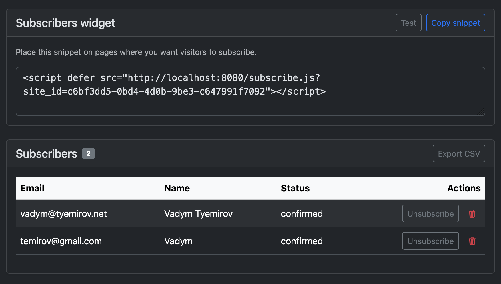
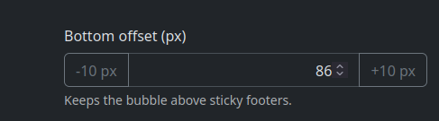

# ISSUES (Append-only section-based log)

Entries record newly discovered requests or changes, with their outcomes. No instructive content lives here. Read @NOTES.md for the process to follow when fixing issues.

Read @AGENTS.md, @ARCHITECTURE.md, @README.md, @PRD.md. Read @POLICY.md, PLANNING.md, @NOTES.md, and @ISSUES.md under issues.md/.  Start working on open issues. Work autonomously and stack up PRs. Prioritize bugfixes.

Each issue is formatted as `- [ ] [<ID>-<number>]`. When resolved it becomes `- [x] [<ID>-<number>]`.

## Features (113–199)
- [x] [LA-111] Allow multiple origins for subscribe widgets, e.g. — a single subscribe widget can be embedded in multiple sites, not all of them matching the original url, such as gravity.mprlab.com needs to be able to be retreieved and function from both https://mprlab.com and http://localhost:8080
  implemented multi-origin support for site `allowed_origin` values (space/comma-separated list), extended backend origin checks and dashboard validation, and updated README to document the behavior.

- [x] [LA-112] Implement the subscription flow: — Send a confirmation email to the subscriber
  The confirmation email contains a link to the loopaware
  When a user clicks the link the subscription is confirmed
  Carefully plan the execution and testing
  implemented double opt-in subscriptions: creating a subscription sends a confirmation email with `GET /subscriptions/confirm?token=...`, and clicking the link confirms the subscriber.

## Improvements (210–299)

- [x] [LA-207] Upgrade to the latest version of mpr-ui. — Check tools/mpr-ui/README.md and @tools/mpr-ui/docs/custom-elements.md and @tols/mpr-ui/demo/index.html for documentation and examples.
  migrated LoopAware templates to the v0.2+ `<mpr-footer>` custom element, loading `mpr-ui@latest/mpr-ui.css` + `mpr-ui@latest/mpr-ui.js`, and removed the legacy `footer.js`/`mprFooter` helper import.
  ```
  Uncaught SyntaxError: The requested module 'https://cdn.jsdelivr.net/gh/MarcoPoloResearchLab/mpr-ui@main/footer.js' doesn't provide an export named: 'mprFooter' subscribe-test:709:14
  ```

- [x] [LA-208] Add front-end for LA-111 which would allow entering multiple origins for the same subscribe widget. — updated the dashboard UI to treat `allowed_origin` as a multi-origin field (space/comma-separated), summarize the primary origin in the sites list, and ensure favicon-click opens the primary origin.

- [x] [LA-209] Add a section selector for Feedback, Subscriptions, Traffic. — added dashboard tabs below Site details to switch between Feedback, Subscriptions, and Traffic sections, showing only the relevant widget + pane at a time.
  Only one section is shown at a time
  Clicking on Feedback shows Feedback widget and Feedback messages panes
  Clicking on Subscriptions shows Subscribers Widget and Subscribers panes
  Clicking on Traffic shows Traffic Widget and Traffic pane
  The idea is that these widgets are now crowding a single screen and we want to hide them under the top selector, so Tabbed navigation will work here

- [x] [LA-210] Style the subscription confirmed page and add a link to open the subscribed site. — replaced the plain-text `/subscriptions/confirm` response with a LoopAware-themed HTML page and added a safe “Open <site>” link (prefers an allowed `source_url`, otherwise the primary allowed origin).

- [x] [LA-211] Add delete action to subscribers pane, using the flow and design approach similar to site deletion in the sites pane — added an authenticated DELETE subscriber endpoint and a dashboard confirmation modal (type email) to remove subscriber records.

- [x] [LA-212] Subscription confirmed page should show Open + Unsubscribe buttons (no “Return to LoopAware” on the confirmed card).
  added a token-based `/subscriptions/unsubscribe?token=...` web route and updated the confirmation page to display “Open <site>” and “Unsubscribe” actions; added coverage.

- [ ] [LA-213] Make the tabs span wider so thay occupy all o their space and divide it in 3 equal parts 

- [ ] [LA-214] Add additional source origins UX to the subscriber widget . Add an extra source origin section before the "Place this snippet on pages where you want visitors to subscribe." have + and - buttons to add input fields with extra allowed source origins.

- [ ] [LA-215] Improve instructions for the subscribe widget. copying the script probably won't be sufficient, so we shall have two pieces:
1. <script defer src="http://localhost:8080/subscribe.js?site_id=12665b6e-78a2-421f-9149-04be800f6245"></script>
2. The form that actually displays the subscribe fields

## BugFixes (312–399)

- [x] [LA-311] TestWidgetIntegrationSubmitsFeedback can time out under `make ci` race tests with a `context deadline exceeded` error from the headless browser harness; investigate and stabilize the widget integration test so `make ci` passes reliably — simplified the keyboard focus assertions in the widget integration test to avoid brittle Shift+Tab focus loops while preserving end-to-end feedback submission coverage; `make test`, `make lint`, and `make ci` now pass cleanly including the race suite.

- [x] [LS-312] Investigate the 403 errro when trying to subscribe on a test subscribe page. — I have entered a valid enail and my name but got an error: "Please try again"
  routed the subscribe-test preview submission through an authenticated `/app/sites/:id/subscribe-test/subscriptions` endpoint (origin checks remain enforced for public `/api/subscriptions`).
  ```
  Error: http_403
    submitInlineForm http://localhost:8080/app/sites/c6bf3dd5-0bd4-4d0b-9be3-c647991f7092/subscribe-test:589
  subscribe-test:599:21
  ```
  Server log:
  ```
  011581307,"ip":"192.168.65.1","ua":"Mozilla/5.0 (Macintosh; Intel Mac OS X 10.15; rv:145.0) Gecko/20100101 Firefox/145.0"}
  loopaware  | {"level":"info","ts":1765747899.0851963,"caller":"httpapi/middleware.go:14","msg":"http","method":"GET","path":"/api/sites/c6bf3dd5-0bd4-4d0b-9be3-c647991f7092/subscribers","status":200,"dur":0.005705436,"ip":"192.168.65.1","ua":"Mozilla/5.0 (Macintosh; Intel Mac OS X 10.15; rv:145.0) Gecko/20100101 Firefox/145.0"}
  loopaware  | {"level":"info","ts":1765747899.0949476,"caller":"httpapi/middleware.go:14","msg":"http","method":"GET","path":"/api/sites/c6bf3dd5-0bd4-4d0b-9be3-c647991f7092/visits/stats","status":200,"dur":0.015284192,"ip":"173.194.65.95","ua":"Mozilla/5.0 (Macintosh; Intel Mac OS X 10.15; rv:145.0) Gecko/20100101 Firefox/145.0"}
  loopaware  | {"level":"info","ts":1765747907.1529574,"caller":"httpapi/middleware.go:14","msg":"http","method":"GET","path":"/app/sites/c6bf3dd5-0bd4-4d0b-9be3-c647991f7092/subscribe-test","status":200,"dur":0.052474132,"ip":"192.168.65.1","ua":"Mozilla/5.0 (Macintosh; Intel Mac OS X 10.15; rv:145.0) Gecko/20100101 Firefox/145.0"}
  loopaware  | {"level":"info","ts":1765747925.552095,"caller":"httpapi/middleware.go:14","msg":"http","method":"POST","path":"/api/subscriptions","status":403,"dur":0.000895133,"ip":"173.194.65.95","ua":"Mozilla/5.0 (Macintosh; Intel Mac OS X 10.15; rv:145.0) Gecko/20100101 Firefox/145.0"}
  loopaware  | {"level":"info","ts":1765747936.5625567,"caller":"httpapi/middleware.go:14","msg":"http","method":"GET","path":"/app/sites/c6bf3dd5-0bd4-4d0b-9be3-c647991f7092/subscribe-test","status":302,"dur":0.000044817,"ip":"173.194.65.95","ua":"Mozilla/5.0 (Macintosh; Intel Mac OS X 10.15; rv:145.0) Gecko/20100101 Firefox/145.0"}
  ```

- [x] [LS-313] Prevent duplicate origins when a site's `allowed_origin` contains multiple origins (comma/space-separated). — updated conflict detection to compare per-origin rather than the raw `allowed_origin` string and added coverage.

- [x] [LA-314] Pinguin notification calls fail with `tenant_id is required` when submitting feedback/subscriptions. — added `PINGUIN_TENANT_ID` config and send it as `x-tenant-id` gRPC metadata on Pinguin notification requests.

- [x] [LA-315] mpr-ui footer: 
  restored the `<mpr-footer>` default class hooks (so internal padding is applied) and updated the menu label to read “Built by Marco Polo Research Lab”.

- [x] [LS-316] Subscription confirmation flow sends notifications before confirmation — updated subscription creation to send a subscriber confirmation email first and defer owner notifications until the subscription is confirmed, including the authenticated subscribe-test preview flow; added coverage.

- [ ] [LS-317] the menu label “Built by Marco Polo Research Lab” is invisible. Consult the examples in @tools/mpr-ui/demo and be sure not to override any of the mpr-ui css with our own css 

- [ ] [LS-317] the site starts in the light switch toogle on the left which shall be light theme but it displays dark theme. FIx it and make the toggle on the left be light theme and the toggle on the right be dark theme 

## Maintenance (405–499)

- [x] [LA-403] Document pixel integration in the @README.md — added pixel.js snippet, REST endpoints, and traffic dashboard description to README.md
- [x] [LA-405] Stabilize Go tooling and tests by reducing reliance on external tool downloads and network listeners. — pinned `staticcheck`/`ineffassign` fallback versions in `make lint`, prefer locally installed binaries when present, and refactored favicon resolver + HTTPAPI tests to use a local listener/stub HTTP client instead of `httptest.NewServer` where practical.
- [x] [LA-406] Cleanup:
  1. Review the completed issues and compare the code against the README.md and ARCHITECTURE.md files.
  2. Update the README.md and ARCHITECTURE.
  3. Clean up the completed issues.
  reconciled the README REST API table, subscription token routes, and dashboard feature list with the shipped behavior; expanded ARCHITECTURE.md with an overview of components and key flows.

## Planning (do not implement yet)
