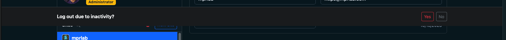

# ISSUES (Append-only section-based log)

Entries record newly discovered requests or changes, with their outcomes. No instructive content lives here. Read @NOTES.md for the process to follow when fixing issues.

Read @AGENTS.md, @ARCHITECTURE.md, @README.md, @PRD.md. Read @POLICY.md, PLANNING.md, @NOTES.md, and @ISSUES.md under issues.md/.  Start working on open issues. Work autonomously and stack up PRs. Prioritize bugfixes.

Each issue is formatted as `- [ ] [LA-<number>]`. When resolved it becomes `- [x] [LA-<number>]`.

## Features (117–199)

- [x] [LA-113] Add `target` parameter to subscribe.js for rendering into specific DOM elements.
  Priority: P1
  Goal: Allow subscribe.js to render the subscribe form into a specific element instead of always appending to document.body. This enables embedding the subscribe widget inside cards, modals, or other constrained containers without using iframes.
  Deliverable: PR that adds `target` parameter support to subscribe.js; form renders into `document.getElementById(targetId)` when specified, falls back to `document.body` when not.
  Use case: Marco Polo Research Lab landing page embeds subscribe forms on flippable card backs. Using iframes causes CORS issues (srcdoc iframes have `Origin: null`). Direct embedding with target parameter avoids this.
  Resolution: Added target param/data-target support to subscribe.js and integration coverage ensuring inline forms render into the requested container.
  Implementation notes:
  - Add `target` to `parseConfig()` alongside existing params
  - Support both URL param (`?target=my-element-id`) and data attribute (`data-target="my-element-id"`)
  - Modify `renderInline()` to accept optional `targetElement` parameter
  - Resolve target in `main()`: `document.getElementById(config.targetId)` or fallback to `document.body`
  Docs/Refs:
  - `internal/httpapi/assets/subscribe.js`
- [x] [LA-114] Subscribe test page needs a target element ID input for subscribe.js previews.
  Priority: P1
  Goal: Let operators set the subscribe.js target element ID on the test page so inline previews render into the specified container.
  Deliverable: Target element ID input wired to the inline preview container and integration coverage verifying the preview updates.
  Docs/Refs:
  - `internal/httpapi/templates/subscribe_test.tmpl`
  - `internal/httpapi/site_subscribe_test_handlers.go`
  - `internal/httpapi/dashboard_integration_test.go`
  Resolution: Added a target input that updates the inline preview container ID, and integration coverage asserting the preview renders in the updated target; `make ci` passes.
- [x] [LA-115] (P0) Integrate logged in drop down with the latest version of mpr-ui.
  mpr-ui provides the mpr-user element which can be integrated with tauth and shown instead of custom logic we employ for displaying a user. Check @tools/mpr-ui for the documentation and @tools/mpr-ui/demoi for the integration examples
  Resolution: Pinned all LoopAware runtime pages from `mpr-ui@latest` to `mpr-ui@3.6.6` because jsDelivr `@latest` currently resolves to `3.6.5`; validated with `make ci` (including full integration suite).
  Docs/Refs:
  - `web/app/index.html`
  - `web/app/subscribe-test/index.html`
  - `web/app/traffic-test/index.html`
  - `web/app/widget-test/index.html`
  - `web/login/index.html`
  - `web/privacy/index.html`
  - `web/subscriptions/confirm/index.html`
  - `web/subscriptions/unsubscribe/index.html`
- [x] [LA-116] (P1) Refactor LoopAware into a separate frontend and backend to adopt TAuth via mpr-ui.
  Priority: P0
  Goal: Split the UI into a dedicated frontend app that loads `tauth.js` + mpr-ui DSL, while the backend becomes a clean API that validates TAuth sessions.
  Deliverable: A documented architecture/migration plan that defines service boundaries, routing/origin model, auth flow, and rollout steps.
  Docs/Refs:
  - `tools/TAuth/docs/usage.md`
  - `tools/TAuth/docs/migration.md`
  - `issues.md/AGENTS.FRONTEND.md`
  - `issues.md/AGENTS.GO.md`
  - `issues.md/AGENTS.DOCKER.md`
  Resolution: Added `--serve-mode` (`monolith|web|api`) to `cmd/server`, updated `docker-compose.computercat.yml` + ghttp proxy templates to run split `loopaware-web` and `loopaware-api` behind a single origin, and documented rollout/routing in `docs/LA-116-split-frontend-backend.md`; `make ci` passes.

## Improvements (416–515)

- [x] [LA-213] Dashboard section tabs should span full width and split into 3 equal parts.
  Priority: P2
  Goal: Feedback/Subscriptions/Traffic tab buttons fill the available width and each takes exactly 1/3 of the row (responsive).
  Deliverable: PR adjusting tab markup/CSS and updating dashboard integration tests as needed.
  Resolution: Switched section tabs to `nav-justified` + `w-100` and added headless integration assertions for equal computed tab widths.
- [x] [LA-339]  Remove the full name login area in favor of current avatar only design .
  Ensure that the layout for the full name and log out button is deleted from all pages
  Resolution: Added auth script binding on widget/subscribe/traffic test pages and integration coverage confirming the default header profile layout is removed; `make ci` passes.
- [x] [LA-413] Autosave should not reload the dashboard or interrupt typing while editing site settings.
  Priority: P1
  Goal: Autosave site edits without refreshing the form or dropping focus while operators type.
  Deliverable: PR adding debounced autosave with integration coverage proving input focus/value persists during autosave.
  Docs/Refs:
  - `internal/httpapi/templates/dashboard.tmpl`
  - `internal/httpapi/dashboard_integration_test.go`
  Resolution: Added debounced autosave for site settings with a non-invasive render path and integration coverage that preserves subscribe-origin typing; `make ci` passes.
- [x] [LA-414] Remove the remnant avatar/name/sign-out markup that appears alongside the LoopAware header profile menu.
  Priority: P1
  Goal: Only the LoopAware profile dropdown renders in the dashboard header; default mpr-ui profile elements remain hidden/removed.
  Deliverable: PR that removes the duplicate header markup and adds integration coverage for a single visible profile control.
  Docs/Refs:
  - `internal/httpapi/templates/dashboard_header.tmpl`
  - `internal/httpapi/templates/dashboard.tmpl`
  - `internal/httpapi/public_assets.go`
  - `tools/mpr-ui/docs/custom-elements.md`
  Resolution: Removed default mpr-ui profile/settings/sign-in elements when the LoopAware profile menu is present and added integration coverage ensuring they are absent; `make ci` passes.
- [x] [LA-415] Dashboard sign-in requires multiple attempts instead of completing on first click.
  Priority: P1
  Goal: The first sign-in interaction completes authentication without extra prompts or repeat clicks.
  Deliverable: PR that eliminates double sign-in behavior and adds integration coverage for a single sign-in flow.
  Docs/Refs:
  - `internal/httpapi/public_assets.go`
  - `internal/httpapi/templates/dashboard_header.tmpl`
  - `tools/mpr-ui/docs/custom-elements.md`
  - `tools/TAuth/docs/usage.md`
  Resolution: Gated the Google sign-in control until the nonce-backed GIS initialization is available and added integration coverage to verify the gate releases after nonce readiness; `make ci` passes.

## BugFixes (339–399)

- [x] [LA-317] mpr-ui footer menu label “Built by Marco Polo Research Lab” is invisible.
  Priority: P1
  Goal: Footer label is visible in both light and dark themes and matches the mpr-ui demo styling.
  Deliverable: PR that removes/adjusts conflicting CSS and validates footer label visibility; screenshot-based evidence if needed.
  Resolution: Stop passing `toggle-button-id` so mpr-ui can populate the footer menu button label/classes, and synchronize `data-mpr-theme` with `data-bs-theme` so light-mode tokens apply; added headless integration coverage for computed label color.
  Docs/Refs:
  - `tools/mpr-ui/demo/index.html`
  - `internal/httpapi/templates/dashboard.tmpl`
  - `internal/httpapi/public_assets.go`
  Execution plan:
  - Compare LoopAware footer DOM/CSS against the mpr-ui demo.
  - Identify overriding selectors in LoopAware CSS (especially for footer text colors).
  - Adjust styles to avoid clobbering mpr-ui defaults; verify both themes.
- [x] [LA-318] Theme toggle defaults and mapping are wrong (left = light, right = dark).
  Priority: P0
  Goal: The left toggle state represents light theme, the right state represents dark theme, and the initial UI state matches the applied theme.
  Deliverable: PR that fixes theme toggle behavior across landing, dashboard, and public pages; automated coverage updated.
  Resolution: Reordered `mpr-footer` theme modes to `light` then `dark` and added headless integration coverage for landing/privacy/dashboard toggle state + applied theme.
  Docs/Refs:
  - `issues.md/AGENTS.FRONTEND.md`
  - `internal/httpapi/footer.go`
  - `internal/httpapi/templates/dashboard.tmpl`
  - `internal/httpapi/public_assets.go`
  Execution plan:
  - Identify the single source of truth for theme mode (document attribute + storage key).
  - Fix toggle UI state mapping (mpr-ui footer event + local storage + `data-bs-theme`).
  - Add/adjust integration assertions around theme attribute and toggle state.
- [x] [LA-319] Additional subscribe origins may not persist/display after saving and returning to the site editor.
  Priority: P1
  Goal: When operators add additional subscribe origins, save the site, and later re-open the same site in the dashboard, the saved origins are shown in the “Additional subscribe origins” editor.
  Deliverable: PR with a reproducible failing test + fix (or documented repro steps if environment-specific).
  Notes: Reported behavior is “added origins do not appear after returning to the site”; confirm whether the operator clicked Save, and whether the dashboard was refreshed or the site was re-selected without a reload.
  Resolution: Unable to reproduce after verifying persistence/rehydration coverage for subscribe origins.
  Docs/Refs:
  - `internal/httpapi/templates/dashboard.tmpl`
  - `internal/httpapi/admin.go` (site responses)
  - `internal/httpapi/subscribe_allowed_origins_dashboard_integration_test.go`
- [x] [LA-320] Login loop between `/login` and `/app` when TAuth session cookie name is customized.
  Priority: P0
  Goal: Dashboard loads after successful TAuth login; LoopAware validates the configured session cookie name.
  Deliverable: PR that passes the TAuth session cookie name into the validator and updates env/docs.
  Notes: LoopAware currently assumes `app_session`; TAuth tenant uses `app_session_loopaware`.
  Resolution: Added `TAUTH_SESSION_COOKIE_NAME` config/flag, wired it into session validation, and updated env samples/docs plus config-audit.
  Docs/Refs:
  - `cmd/server/main.go`
  - `internal/httpapi/auth.go`
  - `configs/.env.loopaware`
- [x] [LA-321] Logout should redirect to the landing page from authenticated views.
  Priority: P1
  Goal: After logging out via the header, the dashboard (and related authenticated pages) return to `/login`.
  Deliverable: PR that redirects on `mpr-ui:auth:unauthenticated` when configured on dashboard headers.
  Resolution: Added a logout-redirect flag to dashboard headers and routed unauthenticated events back to the landing path.
  Docs/Refs:
  - `internal/httpapi/public_assets.go`
  - `internal/httpapi/templates/dashboard_header.tmpl`
- [x] [LA-322] Landing theme preference does not persist to the dashboard after login.
  Priority: P1
  Goal: When no explicit theme is stored, the landing theme persists to localStorage and the dashboard uses it after login.
  Deliverable: PR that persists the landing default theme and adds integration coverage for landing-to-dashboard theme propagation.
  Notes: Landing defaults to dark without persisting; dashboard defaults to light when no preference exists.
  Resolution: Persisted landing default theme on boot and added integration coverage for landing-default propagation into the dashboard.
  Docs/Refs:
  - `internal/httpapi/public_assets.go`
  - `internal/httpapi/dashboard_integration_test.go`
  - `internal/httpapi/templates/dashboard.tmpl`
- [x] [LA-323] Dashboard header profile menu regressed to oversized buttons after TAuth migration.
  Priority: P1
  Goal: Restore the avatar dropdown with account settings and logout while keeping TAuth-backed authentication.
  Deliverable: PR that renders the profile dropdown and updates integration coverage for opening the settings modal.
  Notes: The header currently shows separate large buttons instead of a compact dropdown menu.
  Resolution: Reintroduced a compact avatar dropdown in the dashboard header, hid the built-in header actions, added dropdown open fallbacks, and updated integration coverage to open the menu before clicking settings; `make ci` passes.
  Docs/Refs:
  - `internal/httpapi/public_assets.go`
  - `internal/httpapi/templates/dashboard_header.tmpl`
  - `internal/httpapi/templates/dashboard.tmpl`
  - `internal/httpapi/dashboard_integration_test.go`
- [x] [LA-324] Landing page does not redirect to the dashboard after successful TAuth login.
  Priority: P0
  Goal: When a user authenticates via TAuth, the landing page should redirect them to `/app` once the header is authenticated.
  Deliverable: PR that detects already-authenticated header state on boot, redirects to the dashboard, and adds integration coverage.
  Notes: The header shows the logged-in user, but no navigation occurs.
  Resolution: Avoided HTML-escaped `<` in the auth script loop, added a `getCurrentUser` bootstrap fallback, and tightened the landing redirect integration assertions; `make ci` passes.
  Docs/Refs:
  - `internal/httpapi/public_assets.go`
  - `internal/httpapi/templates/landing.tmpl`
  - `internal/httpapi/landing.go`
  - `internal/httpapi/dashboard_integration_test.go`
- [x] [LA-325] Logout does not clear the TAuth session from the dashboard header.
  Priority: P0
  Goal: Clicking Logout clears the TAuth session cookie and returns the user to `/login`, with the header showing unauthenticated state on reload.
  Deliverable: PR that wires the custom dropdown logout to the same auth/logout path as mpr-ui (or TAuth), with integration coverage for logout + redirect.
  Notes: The custom menu uses `public_assets.go` `handleLogout` → `window.logout` fallback; if `tauth.js` is missing/mis-wired, we redirect without invalidating the session. Confirm the logout helper includes `X-TAuth-Tenant` and correct `tauth-url`. If the issue is in `tauth.js` or mpr-ui auth helpers, note/update those repos.
  Resolution: Always issue a direct `/auth/logout` POST after `window.logout` (tauth.js swallows errors), plus logout integration coverage that asserts the logout request and landing redirect; `make ci` passes.
  Docs/Refs:
  - `internal/httpapi/public_assets.go`
  - `internal/httpapi/templates/dashboard_header.tmpl`
  - `tools/mpr-ui/docs/custom-elements.md`
  - `tools/TAuth/docs/migration.md`
- [x] [LA-326] Account settings modal opens blank from the header dropdown.
  Priority: P1
  Goal: The Account settings action opens a modal with the expected auto-logout controls and descriptive copy across both themes.
  Deliverable: PR that ensures the modal renders content and remains readable in both light/dark modes; add integration coverage for settings modal visibility + content.
  Notes: The menu item targets `SettingsModalID`, but users report an empty modal. Verify Bootstrap modal wiring, `SettingsModalID` parity between `dashboard_header.tmpl` and `dashboard.tmpl`, and theme styling that could render content invisible. Consider migrating to `<mpr-settings>` if the modal is brittle.
  Resolution: Bound the dropdown settings action to open the Bootstrap modal directly from the custom profile menu and added integration coverage that asserts modal content text + contrast; `make ci` passes.
  Docs/Refs:
  - `internal/httpapi/templates/dashboard_header.tmpl`
  - `internal/httpapi/templates/dashboard.tmpl`
  - `internal/httpapi/web.go`
- [x] [LA-327] Dashboard header/footer palette is out of sync with body theme.
  Priority: P1
  Goal: Header, footer, and body share the same light/dark palette so the UI feels cohesive in both themes.
  Deliverable: PR that aligns mpr-ui theme tokens with Bootstrap theme state (or documents a new preset) and adds integration coverage for theme consistency.
  Notes: Landing page overrides `--mpr-color-*` tokens, but dashboard does not. mpr-ui uses its own CSS variables keyed off `data-mpr-theme`, while the dashboard applies Bootstrap classes; the palettes can diverge. If a shared preset or `data-bs-theme` integration belongs in mpr-ui, note it for that repo.
  Resolution: Bind Bootstrap body color variables to mpr-ui theme tokens and drop conflicting body bg classes, plus new integration coverage comparing header/footer palette deltas against the body in light/dark modes; `make ci` passes.
  Docs/Refs:
  - `internal/httpapi/templates/dashboard.tmpl`
  - `internal/httpapi/public_assets.go`
  - `tools/mpr-ui/README.md`
- [x] [LA-328] Dashboard header profile toggle should be avatar-only with dropdown actions.
  Priority: P1
  Goal: The header shows a single avatar (no wide name button) that opens the settings/logout dropdown; display name can appear inside the menu.
  Deliverable: PR that adjusts header markup/CSS and updates profile name injection logic to render inside the dropdown instead of the toggle.
  Notes: `dashboard_header.tmpl` currently renders the name inside the toggle button, producing a large pill button. Update the template and `public_assets.go` profile sync to support the compact avatar-only toggle.
  Resolution: Moved the display name into the dropdown, rendered an avatar-only toggle with updated header styling and profile sync attributes, and added integration coverage for avatar-only toggle/menu display; landing auth harness now stubs mpr-ui auth bootstrap to keep redirect checks stable; `make ci` passes.
  Docs/Refs:
  - `internal/httpapi/templates/dashboard_header.tmpl`
  - `internal/httpapi/templates/dashboard.tmpl`
  - `internal/httpapi/public_assets.go`
  - `internal/httpapi/dashboard_integration_test.go`
- [x] [LA-329] Logout button does not terminate the session after the header refactor.
  Priority: P1
  Goal: Clicking Logout clears the TAuth session and returns the user to the landing page without re-authentication loops.
  Deliverable: PR that hardens the logout flow against helper/fetch failures and adds integration coverage for the fallback behavior.
  Notes: Regression observed after the header dropdown refactor; logout should still work even when the TAuth helper or fetch path fails (e.g., transient CORS issues). If the fix needs a TAuth change, document it here.
  Resolution: Added a form-post fallback when both `window.logout` and the fetch path fail, and added integration coverage that forces both failures and verifies the fallback + redirect; `make ci` passes.
  Docs/Refs:
  - `internal/httpapi/public_assets.go`
  - `internal/httpapi/dashboard_integration_test.go`
- [x] [LA-330] Header dropdown actions are unresponsive in some sessions.
  Priority: P1
  Goal: Settings and logout reliably bind even when the header renders late or auth attributes update before slot content mounts.
  Deliverable: PR that retries custom profile binding and resolves logout endpoints from tauth.js when available, plus coverage if possible.
  Notes: Users report the settings modal and logout action do nothing; likely the custom menu handlers never attach or the logout request targets the wrong origin.
  Resolution: Added retry logic for custom profile binding, made logout prefer tauth.js `getAuthEndpoints()` when available, and relaxed settings click handling so Bootstrap’s data API still works when manual modal control is unavailable; `make ci` passes.
  Docs/Refs:
  - `internal/httpapi/public_assets.go`
  - `internal/httpapi/dashboard_integration_test.go`
- [x] [LA-331] Remove auth fallbacks and rely solely on mpr-ui auth events.
  Priority: P1
  Goal: Login/logout announcements and redirects are driven only by `mpr-ui:auth:*` events, without MutationObserver or manual bootstrap fallbacks.
  Deliverable: PR that removes attribute/observer fallbacks and confirms event-driven redirects still work.
  Notes: Required to align with mpr-ui integration guidance and avoid double-trigger behavior.
  Resolution: Removed attribute observers/bootstraps, and now dispatches `mpr-ui:auth:authenticated` when dashboard user data loads so the header updates via events only; `make ci` passes.
  Docs/Refs:
  - `internal/httpapi/public_assets.go`
  - `internal/httpapi/templates/dashboard.tmpl`
- [x] [LA-332]  The logout notification is floating in space instead of being sticky to the bottom of the screen.
  Priority: P1
  Goal: Session timeout notification is fixed to the bottom edge of the viewport.
  Deliverable: PR that pins the timeout notification to the bottom and adds integration coverage for its position.
  Resolution: Added bottom anchoring to the timeout banner and integration coverage asserting its bottom alignment.
- [x] [LA-333] Safari header dropdown actions are unresponsive after auth.
  Priority: P1
  Goal: Avatar dropdown opens and settings/logout clicks work on Safari without missing bindings.
  Deliverable: PR that makes header menu bindings resilient to mpr-ui re-renders; update tests if feasible.
  Notes: Safari appears to drop or never attach the click handlers on the avatar menu items, so no logout request is sent and the settings modal never opens.
  Resolution: Switched auth script rendering to a text template to prevent HTML escaping in JS, and added delegated profile menu click handling to keep settings/logout responsive across browsers; `make ci` passes.
  Docs/Refs:
  - `internal/httpapi/public_assets.go`
  - `internal/httpapi/templates/dashboard_header.tmpl`
  - `tools/mpr-ui/docs/custom-elements.md`
- [x] [LA-334] Logout occurs much faster than the configured timeout.
  Priority: P1
  Goal: Authentication sessions honor the configured timeout before forcing logout.
  Deliverable: PR that identifies the premature logout trigger, aligns the effective timeout with configuration, and adds/updates integration coverage for session duration.
  Notes: Reported behavior indicates logout occurs significantly earlier than the configured session timeout; confirm whether this is driven by the dashboard inactivity timer vs. server/TAuth session expiry.
  Resolution: Scoped auto-logout settings to user-specific storage keys, clear legacy storage after migration, and added integration coverage to confirm per-user settings; `make ci` passes.
- [x] [LA-335] Google Sign-In auto-suggests login after a timed-out logout.
  Priority: P1
  Goal: After an inactivity-triggered logout, Google Sign-In should not immediately prompt or auto-suggest login without user action.
  Deliverable: PR that suppresses auto-prompt/auto-select behavior after timeout-driven logout and adds integration coverage for the post-timeout login UX.
  Notes: Observed behavior is a Google Sign-In prompt immediately after timeout logout; confirm whether GIS auto-select or mpr-ui auth bootstrap is responsible and ensure the prompt only appears on explicit user intent.
  Resolution: Disabled Google auto-select during timeout-driven logout and added integration coverage to verify the suppression; `make ci` passes.
- [x] [LA-336] Additional subscribe origins disappear after logout/login.
  Priority: P1
  Goal: Additional subscribe origins remain visible in the dashboard editor after a logout/login cycle and are enforced by the backend.
  Deliverable: PR that persists and rehydrates additional subscribe origins in the UI after re-auth and adds coverage for visibility + origin enforcement.
  Notes: Reported behavior: added origins are not shown after logging out and back in, even though they were saved.
  Resolution: Unable to reproduce; added headless coverage to rehydrate subscribe origins after re-login and verified persistence in storage.
- [x] [LA-337] Subscribe form renders a name field even when the widget disables it.
  Priority: P1
  Goal: When the subscribe widget requests no name field, the rendered form omits it consistently across embed/test flows.
  Deliverable: PR with a failing integration test plus a fix that honors the widget flag end-to-end.
  Notes: Reported behavior: subscribe form still renders the name input even when the widget says no name.
  Resolution: Omitted the name input when `name_field=false` in the embed script and subscribe test preview, with integration coverage asserting the field is absent.
  Docs/Refs:
  - `internal/httpapi/subscribe_template.go`
  - `internal/httpapi/subscribe_demo_template.go`
  - `internal/httpapi/templates/subscribe_test.tmpl`
- [x] [LA-338] Defer timeout start until user settings are loaded.
  Because applyAutoLogoutSettingsForUser(null) runs before loadUser() and the session-timeout manager is started before loadUser() resolves (see sessionTimeoutStartRequested/sessionTimeoutManager.start() later in this template), the idle timer begins with default settings until the user-specific key is known. After this change clears the legacy base key, a slow /me response (e.g., degraded API or high latency) can trigger the 60/120-second defaults even for users who have configured longer timeouts, reintroducing “premature logout” in that scenario. Consider delaying sessionTimeoutStartRequested until applyAutoLogoutSettingsForUser(state.user) runs or caching the last user key so the correct settings are loaded before starting the timer.
  Resolution: Deferred session-timeout start until after user settings load and added integration coverage with a delayed /api/me response to confirm the start gate.

## Maintenance (418–499)

- [x] [LA-406] Cleanup:.
  1. Review the completed issues and compare the code against the README.md and ARCHITECTURE.md files.
  2. Update the README.md and ARCHITECTURE.
  3. Clean up the completed issues.
  reconciled the README REST API table, subscription token routes, and dashboard feature list with the shipped behavior; expanded ARCHITECTURE.md with an overview of components and key flows.
- [x] [LA-407] Polish:.
  1. Review each open issue
  2. Add additional context: dependencies, documentation, execution plan, goal
  3. Add priroity and deliverable. Reaarange and renumber issues as needed.
- [x] [LA-408] Dashboard widget bottom offset integration test fails after dependency updates.
  Priority: P1
  Goal: Ensure the dashboard widget bottom offset test waits for site selection/value population so it passes after dependency updates.
  Deliverable: PR updating the integration test readiness with passing `make ci`.
  Notes: Failure observed in `TestDashboardWidgetBottomOffsetStepButtonsAdjustAndPersist` due to an empty bottom offset input value.
  Resolution: Added a site-selection readiness wait to the integration test; `make ci` passes.
- [x] [LA-409] Migrate LoopAware auth UI and server validation to the latest TAuth client integration.
  Priority: P0
  Goal: Replace GAuss session handling with TAuth session validation and use the mpr-ui declarative DSL (with `tauth.js`) for auth UI.
  Deliverable: PR updating templates, auth middleware, and config to use `tauth.js` + `<mpr-header>`; tests and `make ci` pass.
  Notes: Follow `tools/TAuth/docs/migration.md` and mpr-ui docs; ensure refresh handling via `apiFetch` and update login/logout flows.
  Resolution: Replaced GAuss sessions with TAuth validator, wired mpr-ui header + `tauth.js` across templates, updated env/config/doc/test coverage, and verified `make ci`.
- [x] [LA-411] Align LoopAware footer integration with mpr-ui v3.4.0 DSL.
  Priority: P1
  Goal: Remove legacy footer attributes (`links`, `theme-mode`) and sync theme state via `theme-config` + document attributes while keeping toggle behavior and link catalog intact.
  Deliverable: PR that updates footer rendering + theme scripts/tests to use `links-collection` and `theme-config.initialMode`; `make ci` passes.
  Docs/Refs:
  - `tools/mpr-ui/docs/custom-elements.md`
  - `tools/mpr-ui/CHANGELOG.md`
  - `pkg/footer/footer.go`
  - `internal/httpapi/public_assets.go`
  - `internal/httpapi/templates/dashboard.tmpl`
  Resolution: Switched footer rendering to `links-collection`, moved initial theme into `theme-config.initialMode`, removed `theme-mode` syncing, and updated landing/privacy/dashboard/theme toggle tests; `make ci` passes.
- [x] [LA-412] do not allow repeated login dialog after log out.
  Currently a dialog to log in appears after logout. DO not allow it, and expect users explicit actions instead.
  Google Sign in shows automatic pop up to log in. That is unnessary and we want to rely on users explicit click. Investiaget if google sign in offers a parameter in its initialization to disable auto-login, check if we can use it with TAuth/mpr-ui initialization (check @tools/TAuth and @tools/mpr-ui).
  Resolution: Disabled Google auto-select on explicit logout and unauthenticated events and added integration coverage for logout-triggered suppression; `make ci` passes.
- [x] [LA-416] Add missing product and integration docs.
  Priority: P2
  Goal: Provide missing product and integration docs referenced by process instructions and docs.
  Deliverable: PRs adding `PRD.md`, `PLANNING.md`, and mpr-ui custom element/integration guides.
  Docs/Refs:
  - `README.md`
  - `ARCHITECTURE.md`
  - `docs/LA-200-mpr-ui-gauth.md`
  Resolution: Added PRD/PLANNING docs for LoopAware, and documented mpr-ui custom elements/integration in MarcoPoloResearchLab/mpr-ui#127; `make ci` passes.
  ### Recurring (600-699)
  **close when done but do not remove**
- [x] [LA-417] Ensure coverage target creates output directory.
  Priority: P2
  Goal: `make coverage` should succeed in a clean checkout by creating the `.cache` directory before writing coverage output.
  Resolution: Added a `mkdir -p $(CURDIR)/.cache` step to the coverage target.
- [x] [LA-418] Header shows duplicate avatars (mpr-header + user menu).
  Priority: P1
  Goal: Render a single avatar (mpr-ui `mpr-user`) and ensure the user menu includes Account settings + Logout.
  Deliverable: Replace legacy profile dropdown with a single `mpr-user` in the header `aux` slot, remove unused legacy code, and add integration coverage guarding against duplicate avatars and missing menu items.
  Docs/Refs:
  - `tools/mpr-ui/docs/custom-elements.md`
  - `internal/httpapi/templates/dashboard_header.tmpl`
  - `internal/httpapi/public_assets.go`
  - `internal/httpapi/dashboard_integration_test.go`
  Resolution: Replaced legacy profile dropdown with a single `mpr-user` avatar menu (Account settings + Logout), removed unused legacy profile CSS/JS, and added integration coverage asserting a single visible avatar + expected menu items on both landing and dashboard; `make ci` passes.
- [x] [LA-419] Docker Compose should serve `computercat.tyemirov.net:4443` with TLS.
  Priority: P1
  Goal: Run the LoopAware + TAuth stack on `https://computercat.tyemirov.net:4443` (not `localhost`) using the shared certificate files.
  Deliverable: Add a docker compose variant that terminates TLS on port `4443` using certs from `/media/share/Drive/exchange/certs/computercat`, and update env/config defaults so the browser uses `https://computercat.tyemirov.net:4443` for LoopAware and TAuth endpoints.
  Docs/Refs:
  - `docker-compose.yml`
  - `tools/TAuth/docs/usage.md`
  Resolution: Added `docker-compose.computercat.yml` using `ghttp` TLS reverse proxy on `:4443` (no nginx), documented required env/proxy setup in `configs/README.md`, and verified `make ci`; `make ci` passes.
- [x] [LA-420] Consolidate environment templates under `configs/`.
  Priority: P1
  Goal: Avoid split `.env*` templates between the repo root and `configs/`; keep Docker Compose configuration and examples in one place.
  Deliverable: Move tracked env templates into `configs/` with `*.example` files, update `README.md` to reference `configs/` env files for `docker compose`, and remove legacy root env templates.
  Resolution: Removed legacy root templates (`.env.sample`, `config.tauth.yaml`), added tracked `configs/.env.*.example` templates, and updated docs to reference the `configs/` env layout; `make ci` passes.
- [x] [LA-421] Provide computercat-ready env templates under `configs/`.
  Priority: P1
  Goal: Make `docker-compose.computercat.yml` runnable on `https://computercat.tyemirov.net:4443` without editing the local-compose env files.
  Deliverable: Add `configs/.env.*.computercat.example` templates and update `docker-compose.computercat.yml` + `configs/README.md` to use dedicated `configs/.env.*.computercat` env files.
  Resolution: Added computercat env templates, switched `docker-compose.computercat.yml` to consume the dedicated env files, and updated docs with copy/edit instructions; `make ci` passes.

## Planning (500–59999)
*do not implement yet*

- [x] [LA-422] (P0) Make split deployment fully independent: web serves all HTML/CSS/JS, api is strictly API-only.
  Goal: Complete the LA-116 migration so ghttp can route `/api/*` to `loopaware-api` and everything else to `loopaware-web` (plus TAuth routes), with no HTML/JS assets served by the api service.
  Deliverable: Move operator tool HTML pages, subscription link pages, and public JS assets (`/widget.js`, `/subscribe.js`, `/pixel.js`) to the web service; move tool JSON endpoints under `/api/sites/*`; add any required public API endpoints (e.g. widget placement config) so the JS assets remain dynamic; update proxy templates and integration coverage; `make ci` passes.
  Docs/Refs:
  - `docs/LA-116-split-frontend-backend.md`
  - `cmd/server/routes.go`
  - `configs/.env.ghttp*.example`
  Resolution: Completed the API-only backend + static web split (see detailed resolution below).
  Verification: `make ci` passes.

- [x] [LA-422] (P0) Make split deployment fully independent: web serves all HTML/CSS/JS, api is strictly API-only.
  Resolution: Completed the strict split. `loopaware-web` now serves all HTML pages and public JS assets (`/widget.js`, `/subscribe.js`, `/pixel.js`, `/subscribe-demo`, subscription link pages, and operator tool pages). `loopaware-api` now serves only `/api/*` endpoints (public ingestion + authenticated APIs), including new public JSON endpoints for widget placement (`GET /api/widget-config`) and subscription link hydration (`GET /api/subscriptions/{confirm-link,unsubscribe-link}`), plus tool endpoints moved under `/api/sites/:id/...`.
  Notes:
  - Public JS assets are static and fetch runtime config from the API.
  - Tool pages and subscription pages are HTML shells that hydrate via API calls (no direct DB access in web mode).
  - gHTTP proxy templates updated to route `/api/` to `loopaware-api`, everything else to `loopaware-web`, plus TAuth routes.
  Verification: `make ci` passes.

- [ ] [LA-426] Replace placeholder-only inputs with labeled fields in the static frontend.
  Priority: P1
  Goal: Remove placeholder-only UX in the dashboard, widget, and subscribe flows and use explicit labels with specific copy.
  Deliverable: Update `web/app` pages plus `web/widget.js` and `web/subscribe.js` to render labeled inputs and remove placeholder text; update any draft/empty state copy to remain specific; `make ci` passes.

- [x] [LA-427] Raise Go coverage above 95% with focused edge-path tests.
  Priority: P1
  Goal: Add missing unit coverage for CLI entrypoints and edge branches without adding defensive production checks.
  Deliverable: New tests for server/configaudit entrypoints, pinguin proto no-ops, storage backfill/open errors, and visit rollup context cancellation; `make coverage` reports >95%.
  Resolution: Added targeted tests for CLI entrypoints, pinguin proto no-ops, storage open/backfill errors, and visit rollup edge paths.
  Verification: `make test`, `make lint`, `make ci`, `make coverage` (95.2% total).

- [x] [LA-428] Run integration tests against the dockerized stack.
  Priority: P1
  Goal: Restore UI/API integration coverage by running Playwright suites against a composed stack that serves `web/` via gHTTP and proxies `/api/*`.
  Deliverable: Add Playwright test harness under `tests/`, `docker-compose.integration.yml`, integration env templates, and update `make test`/`make ci` plus CI workflow triggers; `make ci` passes.
  Resolution: Added Playwright integration harness and Docker compose stack, updated Makefile/CI triggers, documented integration env templates, and added integration pages plus widget input IDs for UI tests.
  Verification: `make test`, `make lint`, `make ci`.

- [x] [LA-429] Support multi-origin GitHub Pages deployment for `loopaware.mprlab.com`.
  Priority: P1
  Change: When the frontend is served directly from GitHub Pages (no reverse proxy), default the static pages to call the API at `https://loopaware-api.mprlab.com` and load auth from `https://tauth-api.mprlab.com`.
  Resolution: Added runtime origin selection (hostname-based defaults plus `?api_origin=...&tauth_origin=...` overrides), updated widget/subscription/pixel snippets to carry `api_origin`, and removed hardcoded `localhost` references from assets.
  Verification: `make ci` passes.

- [x] [LA-430] Centralize frontend environment mapping for production vs development.
  Priority: P1
  Change: Define a hostname-based environment map so the static frontend can run on GitHub Pages in production and behind a single-origin reverse proxy in development (computercat).
  Resolution: Added `web/runtime-env.js` and updated pages to consume `window.__LOOPAWARE_{API,TAUTH,PINGUIN}_ORIGIN__` instead of duplicating hostname logic across HTML files.
  Verification: `make ci` passes.

- [x] [LA-431] Load frontend runtime origins from `web/config.yml` and drop unused service mappings.
  Priority: P1
  Change: Move the hostname-to-service origin map out of JavaScript and into a static `config.yml` fetched over HTTP at runtime.
  Resolution: Added `web/config.yml` and refactored `web/runtime-env.js` to fetch + validate it synchronously during boot (preserving script ordering), removed all Pinguin-related globals and query params, and now fail fast with a specific error when the hostname is not mapped.
  Verification: `make ci` passes.

- [x] [LA-432] Make `web/config.yml` real YAML (not JSON-in-YAML) for production editing.
  Priority: P1
  Change: Store the frontend environment map as standard YAML so operators can edit it without JSON syntax.
  Resolution: Converted `web/config.yml` to YAML and updated `web/runtime-env.js` to parse it via `js-yaml` (loaded from a pinned CDN script before bootstrap) while retaining strict validation + fail-fast behavior.
  Verification: `make ci` passes.

- [x] [LA-433] Fix dashboard favicon/avatar URLs in multi-origin GitHub Pages deployments.
  Priority: P1
  Change: When the frontend is hosted on GitHub Pages (`loopaware.mprlab.com`) and the API runs on a separate origin,
  the API returns relative resource URLs (for example `/api/sites/:id/favicon` and `/api/me/avatar`). The dashboard must
  resolve these URLs against the configured API origin instead of the static site origin to avoid 404s.
  Resolution: Updated `web/app/index.html` to resolve `favicon_url` and `avatar.url` through `apiUrl()` (which now treats
  `data:`/`blob:` URLs as absolute), ensuring the browser loads these assets from `loopaware-api.mprlab.com` in multi-origin
  mode while preserving the single-origin reverse-proxy behavior.
  Verification: `make ci` passes.

- [x] [LA-434] Fix mpr-ui avatar requests in multi-origin GitHub Pages deployments.
  Priority: P1
  Change: `mpr-ui` consumes `data-user-avatar-url` and the `mpr-ui:auth:authenticated` profile payload. In multi-origin
  mode the backend may supply a relative `avatar.url` (for example `/api/me/avatar?...`), which `mpr-ui` then loads from
  the Pages origin and triggers 404s.
  Resolution: Updated `web/app/index.html` to resolve the header `data-user-avatar-url` and the dispatched `avatar_url`
  through `apiUrl()` (reusing the configured API origin from `web/config.yml`), so `mpr-ui` loads avatar assets from the
  API host in multi-origin deployments.
  Verification: `make ci` passes.

- [x] [LA-435] Fix dashboard site creation failing with "load failed" due to `OPTIONS /api/sites` returning 404.
  Priority: P0
  Symptom: Clicking "Create site" briefly shows "load failed" and the site is not created; the UI becomes stuck with no further actions available.
  Evidence: API logs show `OPTIONS /api/sites` returning `404`, which breaks browser CORS preflight for JSON `POST /api/sites`.
  Goal: Ensure CORS preflight requests for authenticated API routes succeed (respond with correct `Access-Control-*` headers + `204`) so `POST/PATCH/DELETE` requests work in the browser.
  Deliverable: Backend fix for preflight handling plus integration coverage exercising site creation via the real browser flow; `make ci` passes.
  Resolution: Added explicit `OPTIONS /api/*path` handling in the API router so browser preflight requests no longer fall through to 404, and guarded dashboard data loaders against stale async responses when switching into new-site mode.
  Verification: `make ci` passes.

- [x] [LA-436] Stop re-saving user avatar blobs (and bumping `updated_at`) on every authenticated request.
  Priority: P1
  Symptom: Every request triggers `UPDATE users SET ... avatar_data=<binary> ...` even when the picture URL is unchanged, causing multi-second "SLOW SQL" logs and unnecessary churn.
  Evidence: Repeated slow `SELECT * FROM users` and `UPDATE users` statements originate from `internal/api/auth.go:persistUser` calling `db.Save(&user)` unconditionally.
  Goal: Only update `users` when meaningful fields change; avoid loading/writing `avatar_data` unless the avatar is actually being refreshed.
  Deliverable: Replace unconditional `Save` with targeted updates + lightweight lookups; add tests asserting no-op auth requests do not update `updated_at` or rewrite the avatar blob; `make ci` passes.
  Resolution: Switched `persistUser` to a lightweight snapshot query (no avatar blob reads) plus targeted `Updates` so no-op auth requests avoid rewriting the avatar; added coverage asserting unchanged profiles trigger zero `users` updates.
  Verification: `make ci` passes.

- [x] [LA-437] Coalesce NULL avatar length in auth user snapshot query.
  Priority: P1
  Symptom: `persistUser` selects `length(avatar_data) as avatar_size` into a non-nullable integer field. When `avatar_data` is `NULL`, `length(NULL)` yields `NULL`, which fails scanning and causes `persistUser` to error (repeated `persist_user` warnings; user snapshot never updates).
  Goal: Ensure the snapshot query always returns a non-NULL integer (or make the destination nullable) so auth requests do not fail when `avatar_data` is missing.
  Deliverable: Update query to use `coalesce(length(avatar_data), 0) as avatar_size` (or equivalent) and add regression coverage; `make ci` passes.
  Resolution: Updated the snapshot select to `coalesce(length(avatar_data), 0) as avatar_size`, and added coverage proving users with `NULL` `avatar_data` no longer break subsequent auth requests.
  Verification: `make ci` passes.

- [x] [LA-438] Improve collected traffic statistics with trend, attribution, and engagement analytics.
  Priority: P1
  Goal: Expand dashboard/API traffic insights beyond raw totals so operators can analyze traffic changes over time, source quality, and visit depth.
  Deliverable: Add `/api/sites/:id/visits/trend`, `/api/sites/:id/visits/attribution`, and `/api/sites/:id/visits/engagement` with validated query parameters, update docs, and add integration + Go coverage for normal and edge paths.
  Docs/Refs:
  - `internal/api/site_stats.go`
  - `internal/api/admin.go`
  - `tests/specs/api-admin.spec.js`
  - `README.md`
  - `ARCHITECTURE.md`
  Resolution: Implemented traffic trend, attribution, and engagement aggregations (including bot exclusion and bounded query options), wired authenticated handlers and routing, updated public docs, and added comprehensive Go + Playwright coverage for endpoint behavior and helper/path edge cases.
  Verification: `timeout -k 10s -s SIGKILL 350s make test`, `timeout -k 10s -s SIGKILL 350s make lint`, `timeout -k 10s -s SIGKILL 350s make ci`, and `timeout -k 10s -s SIGKILL 350s make coverage` all pass (`total: 95.1%`).

- [x] [LA-439] Widget `api_origin` should preserve optional path prefixes to avoid `/api/widget-config` 404s.
  Priority: P0
  Symptom: Widgets configured with `api_origin` values like `https://poodlescanner.com/app` were normalized to bare origins (`https://poodlescanner.com`), so widget requests targeted `/api/widget-config` and `/api/feedback` instead of `/app/api/...`, returning 404 in subpath deployments.
  Goal: Keep optional path prefixes in `api_origin` for public widget API calls while preserving current origin-only behavior.
  Deliverable: Update `web/widget.js` API origin normalization and add Playwright coverage that proves widget config + feedback requests use path-prefixed `api_origin` values.
  Resolution: `web/widget.js` now preserves parsed pathname segments (trimming trailing slashes) when normalizing `api_origin`; added `tests/specs/widget-integration.spec.js` coverage (`widget keeps api_origin path prefixes for config and feedback`) that intercepts `/app/api/widget-config` and `/app/api/feedback`.
  Verification: `timeout -k 10s -s SIGKILL 350s make ci` passes (253 Playwright tests).

- [x] [LA-440] Enforce strict-origin semantics for widget `api_origin` (no path support).
  Priority: P0
  Symptom: Allowing path-bearing `api_origin` values blurred contract semantics and diverged from `subscribe.js`/`pixel.js`, where `api_origin` is origin-only (`scheme://host[:port]`).
  Goal: Make widget `api_origin` strict and explicit: accept only absolute origins, reject values containing path/query/hash, and avoid hidden fallback behavior.
  Deliverable: Update `web/widget.js` to reject invalid `api_origin` values at initialization and replace path-prefix integration coverage with a strict-origin rejection assertion.
  Resolution: Widget initialization now logs a clear error and aborts when `api_origin` is not a strict origin; Playwright coverage now asserts path-bearing `api_origin` values are rejected and do not render the widget bubble.
  Verification: `timeout -k 10s -s SIGKILL 350s make ci` passes (253 Playwright tests).

- [x] [LA-441] Normalize visit-trend map keys to `YYYY-MM-DD` before day lookup.
  Priority: P0
  Symptom: `VisitTrend` parsed timestamp-like SQL day values but keyed `entriesByDay` with raw `row.Day`. Later lookup used formatted `dayKey` (`YYYY-MM-DD`), causing real counts to be dropped and replaced with zero-filled days when drivers returned non-day-only strings.
  Goal: Use one canonical key format for both map writes and reads so trend counts remain correct across DB/driver date representations.
  Deliverable: Update `internal/api/site_stats.go` to key trend rows by normalized formatted day and add regression coverage for timestamp-like day strings.
  Resolution: Added `normalizeVisitTrendMapKey` and switched `VisitTrend` row mapping to use parsed-date formatted keys (`visitTrendDayLayout`), plus new test `TestNormalizeVisitTrendMapKeyNormalizesTimestampLikeDayStrings`.
  Verification: `timeout -k 10s -s SIGKILL 30s go test ./internal/api -run 'TestNormalizeVisitTrendMapKeyNormalizesTimestampLikeDayStrings|TestDatabaseSiteStatisticsProviderVisitTrendDefaultsToSevenDays|TestVisitTrendHelperNormalizersAndParsing'`, `timeout -k 10s -s SIGKILL 350s make test`, `timeout -k 10s -s SIGKILL 350s make lint`, and `timeout -k 10s -s SIGKILL 350s make ci` pass.

- [x] [LA-442] Remove WhatsApp from bot user-agent signatures so shared-link traffic is counted as human.
  Priority: P0
  Symptom: The visit collector classified any user-agent containing `whatsapp` as bot traffic, which excluded real in-app browser visits from totals, top pages, trend, attribution, and engagement metrics (`is_bot = false` filters).
  Goal: Treat WhatsApp in-app browser sessions as human visits while keeping existing crawler bot detection intact.
  Deliverable: Remove the `whatsapp` bot token and add regression coverage proving WhatsApp user-agent visits are stored as non-bot and counted by visit stats.
  Resolution: Deleted `whatsapp` from `visitBotUserAgentTokens` in `internal/api/visit_collector.go` and added `TestCollectVisitTreatsWhatsAppUserAgentAsHumanTraffic` in `internal/api/visit_collector_additional_test.go`.
  Verification: `timeout -k 10s -s SIGKILL 60s go test ./internal/api -run 'TestCollectVisitMarksBotTraffic|TestCollectVisitTreatsWhatsAppUserAgentAsHumanTraffic'`, `timeout -k 10s -s SIGKILL 350s make test`, `timeout -k 10s -s SIGKILL 350s make lint`, and `timeout -k 10s -s SIGKILL 350s make ci` pass.

- [x] [LA-443] Include API origin in backend-provided widget snippets for split-origin deployments.
  Priority: P0
  Symptom: Sites embedding the `widget` snippet returned by `/api/sites` received `<script ... src="https://loopaware.mprlab.com/widget.js?site_id=...">` without `api_origin`, so widget config requests targeted `https://loopaware.mprlab.com/api/widget-config` and 404ed when frontend and API were split across origins.
  Goal: Ensure backend-provided widget snippets are valid in split-origin setups by appending an explicit strict `api_origin` when the API request origin differs from the widget script origin.
  Deliverable: Update `internal/api/admin.go` snippet generation, detect API request origin safely (including `X-Forwarded-Proto`), and add regression coverage for same-origin vs split-origin responses.
  Resolution: Reworked backend widget snippet rendering to build script URLs via `buildWidgetSnippet(...)`, added request-origin resolution with forwarded-proto support, and now append `api_origin` only when request/API origin and widget script origin differ; added tests in `internal/api/admin_test.go` and `internal/api/admin_helpers_test.go` for split-origin snippets and helper behavior.
  Verification: `timeout -k 350s -s SIGKILL 350s make test`, `timeout -k 350s -s SIGKILL 350s make lint`, and `timeout -k 350s -s SIGKILL 350s make ci` pass.

- [x] [LA-444] Use HTTPS fallback when proxy omits `X-Forwarded-Proto` during widget snippet origin resolution.
  Priority: P0
  Symptom: `resolveRequestOrigin` defaulted to `http://` unless `X-Forwarded-Proto` or backend TLS was present. In TLS-terminating proxy setups that do not emit `X-Forwarded-Proto` (for example gHTTP), backend-generated widget snippets could append `api_origin=http://...`, causing mixed-content blocking on HTTPS pages.
  Goal: Resolve API origin scheme from trusted signals before building widget snippets: honor `X-Forwarded-Proto`, support standard `Forwarded: proto=...`, and fall back to trusted configured origin scheme when proxy headers are absent.
  Deliverable: Update `internal/api/admin.go` request-origin resolution and add regression coverage for forwarded-header and trusted-origin fallback behavior.
  Resolution: Refactored `resolveRequestOrigin` to accept a trusted configured origin, added standard `Forwarded` proto parsing, and used configured-origin scheme fallback when proxy proto headers are unavailable; wired `CreateSite`, `ListSites`, and `UpdateSite` to pass `handlers.widgetBaseURL` as the trusted origin source.
  Verification: `timeout -k 350s -s SIGKILL 350s make test`, `timeout -k 350s -s SIGKILL 350s make lint`, and `timeout -k 350s -s SIGKILL 350s make ci` pass.

- [x] [LA-445] Build release artifacts only from pushed version tags in `vXX.XX.XX` format.
  Priority: P0
  Symptom: GitHub Pages and Docker image publishing workflows were triggered by `master` branch pushes, so non-release commits could publish deployment artifacts.
  Goal: Restrict release publishing to explicit version tags and enforce the tag naming contract.
  Deliverable: Update `.github/workflows/pages.yml` and `.github/workflows/docker-image.yml` to run on tag pushes, enforce `vXX.XX.XX` format, and document the release process in `README.md`.
  Resolution: Switched both release workflows to `push.tags: v*.*.*`, added runtime validation that requires `^v[0-9]{2}\\.[0-9]{2}\\.[0-9]{2}$`, and documented the release tagging/publish process under `README.md` "Release publishing"; Docker publishing now also tags images with `${{ github.ref_name }}`.
  Verification: `timeout -k 350s -s SIGKILL 350s make test`, `timeout -k 350s -s SIGKILL 350s make lint`, and `timeout -k 350s -s SIGKILL 350s make ci` pass.

- [x] [LA-446] Merge trailing-slash and non-trailing-slash paths in top-pages traffic stats.
  Priority: P0
  Symptom: Traffic top-pages output treated `/path/` and `/path` as separate entries, which split counts for the same human-visible page.
  Goal: Canonicalize top-page path keys so trailing-slash variants collapse into one URI bucket while preserving root `/`.
  Deliverable: Update top-pages aggregation in `internal/api/site_stats.go` and add regression coverage for `/decisioning` and `/civilization` slash variants.
  Resolution: Updated top-pages query grouping to use canonical path expression `CASE WHEN path = / THEN / ELSE RTRIM(path, /) END`, so `/x/` and `/x` merge under `/x`; added regression test `TestDatabaseSiteStatisticsProviderTopPagesMergesTrailingSlashVariants` and aligned integration expectation in `tests/specs/traffic-integration.spec.js`.
  Verification: `timeout -k 350s -s SIGKILL 350s make test`, `timeout -k 350s -s SIGKILL 350s make lint`, and `timeout -k 350s -s SIGKILL 350s make ci` pass.

- [x] [LA-447] Normalize all-slash top-page paths to root `/` to prevent empty traffic buckets.
  Priority: P0
  Symptom: The trailing-slash canonicalization added in LA-446 trimmed `//` and similar all-slash paths to an empty string, so top-pages could emit a blank `path` key instead of `/`.
  Goal: Keep root-like slash-only paths grouped under `/` while retaining trailing-slash merge behavior for non-root paths.
  Deliverable: Update canonical path SQL expression in `internal/api/site_stats.go` and add regression coverage for `/` + `//` aggregation.
  Resolution: Changed canonical grouping to `CASE WHEN TRIM(path, '/') = '' THEN '/' ELSE RTRIM(path, '/') END` so all-slash variants normalize to `/`; added regression test `TestDatabaseSiteStatisticsProviderTopPagesNormalizesAllSlashPathsToRoot`.
  Verification: `timeout -k 10s -s SIGKILL 350s make test`, `timeout -k 10s -s SIGKILL 350s make lint`, and `timeout -k 10s -s SIGKILL 350s make ci` pass.

- [x] [LA-448] Accept standard semantic release tags (`vMAJOR.MINOR.PATCH`) in publish workflows.
  Priority: P0
  Symptom: The release workflows enforced a zero-padded two-digit tag format (`vXX.XX.XX`), so valid SemVer tags such as `v0.1.0` were rejected and release jobs failed before publishing.
  Goal: Align release automation and documentation with standard SemVer tag format expected by operators.
  Deliverable: Update release-tag validation in `.github/workflows/pages.yml` and `.github/workflows/docker-image.yml` to accept `vMAJOR.MINOR.PATCH`, and refresh release documentation wording/examples.
  Resolution: Replaced strict two-digit regex checks with semantic-version validation (`^v(0|[1-9][0-9]*)\\.(0|[1-9][0-9]*)\\.(0|[1-9][0-9]*)$`) in both workflows, and updated `README.md` + `CHANGELOG.md` references from `vXX.XX.XX` to `vMAJOR.MINOR.PATCH` with `v0.1.0` examples.
  Verification: `timeout -k 10s -s SIGKILL 350s make lint` and `timeout -k 10s -s SIGKILL 350s make ci` pass.

- [x] [LA-449] Consolidate tracked LoopAware config sources under `configs/` and remove redundant templates.
  Priority: P1
  Symptom: The repo still had live tracked config files split across the root (`config.yaml`) and `web/` (`web/config.yml`), plus a redundant `configs/.env.ghttp.example` template duplicating the computercat variant.
  Goal: Make `configs/` the source of truth for tracked LoopAware config, remove duplicate templates, and keep Docker/static deployment flows working without path drift.
  Deliverable: Move the LoopAware admin roster and frontend runtime YAML source into `configs/`, update compose/workflow/docs wiring, remove redundant config templates, and extend `config-audit` to validate the active compose variants with current service names.
  Resolution: Moved the tracked admin roster to `configs/config.loopaware.yml` and the frontend runtime source to `configs/config.frontend.yml`; updated server defaults, compose mounts, Pages publishing, `up.sh`, and the integration runner to publish `/config.yml` from that source; removed redundant `configs/.env.ghttp.example`; and taught `cmd/configaudit` to audit all three compose files while resolving `loopaware-api`/`la-pinguin`/`la-tauth` service aliases.
  Verification: `timeout -k 30s -s SIGKILL 30s make format`, `timeout -k 350s -s SIGKILL 350s make test`, `timeout -k 350s -s SIGKILL 350s make lint`, and `timeout -k 350s -s SIGKILL 350s make ci` pass.

- [x] [LA-450] Make `up.sh` and `down.sh` the canonical Docker startup path for localhost and computercat.
  Priority: P1
  Symptom: Docs were drifting between raw `docker compose` commands and helper-script usage, while `up.sh` only handled the computercat stack even though frontend config publication now depends on startup helpers.
  Goal: Make the helper scripts the single documented way to start and stop Dockerized LoopAware for both local and computercat environments.
  Deliverable: Extend `up.sh`/`down.sh` to support both local and computercat modes, and update docs to point operators at those helpers instead of raw `docker compose up`.
  Resolution: `up.sh`/`down.sh` now default to the local compose stack and accept `computercat` as an explicit mode; `up.sh` still publishes `configs/config.frontend.yml` into `web/config.yml` before startup, and the README/config docs now direct operators to `./up.sh`, `./down.sh`, `./up.sh computercat`, and `./down.sh computercat` as the canonical Docker entrypoints.
  Verification: `timeout -k 30s -s SIGKILL 30s bash -n up.sh down.sh` and `timeout -k 350s -s SIGKILL 350s make ci` pass.

- [x] [LA-451] Make Docker startup target selection interactive in `up.sh` and `down.sh`.
  Priority: P2
  Symptom: The helper scripts accepted explicit modes but did not provide the interactive target selector pattern used in the reference repos, so operators had to remember mode names instead of choosing from a menu.
  Goal: Match the existing interactive startup UX used elsewhere while preserving explicit CLI arguments for automation.
  Deliverable: Add an arrow-key selector to `up.sh` and `down.sh` that appears when no mode is passed, and refresh docs to mention the selectable behavior plus explicit `local`/`computercat` arguments.
  Resolution: Added interactive target selectors to both helper scripts using the same Up/Down/Enter menu pattern as the reference repos; non-interactive runs still work when an explicit mode is passed, and docs now describe the selector plus explicit `./up.sh local` / `./up.sh computercat` forms.
  Verification: `timeout -k 30s -s SIGKILL 30s bash -n up.sh down.sh` and `timeout -k 350s -s SIGKILL 350s make ci` pass.

- [x] [LA-452] Reject legacy repo-root env duplicates outside `configs/`.
  Priority: P1
  Symptom: Legacy local env files such as `.env.loopaware` and `.env.pinguin` could still sit at the repo root even though Compose and helper scripts now read `configs/.env.*`, leaving duplicated secrets and configuration outside the declared source-of-truth folder.
  Goal: Ensure active env files live under `configs/` only, and fail fast when root-level duplicates reappear.
  Deliverable: Extend `config-audit` to reject repo-root `.env.*` duplicates, document that root copies are unsupported, migrate any remaining local values into `configs/.env.*`, and remove the legacy root files.
  Resolution: `cmd/configaudit` now fails when `.env.loopaware`, `.env.tauth`, `.env.pinguin`, or `.env.ghttp` exist at the repo root; `configs/README.md` now states that those root files are unsupported; and the remaining local root env values were merged into `configs/.env.*` before deleting the redundant root copies.
  Verification: `timeout -k 30s -s SIGKILL 30s go test ./cmd/configaudit`, `timeout -k 350s -s SIGKILL 350s make lint`, and `timeout -k 350s -s SIGKILL 350s make ci` pass.

- [x] [LA-453] Remove redundant `configs/.env.ghttp` and stop persisting generated integration env copies.
  Priority: P1
  Symptom: The `configs/` directory still accumulated redundant env files: a plain `configs/.env.ghttp` file that no active compose stack reads, plus `.integration` env copies that could be regenerated from the tracked templates but were left behind after test runs.
  Goal: Keep only active or intentionally overridden env files under `configs/`, and reduce drift between local dev, integration, and computercat env sets.
  Deliverable: Make `config-audit` reject unsupported `configs/.env.ghttp`, teach the integration runner to clean up generated `.integration` env files, document the lifecycle of integration env overrides, and normalize the local dev env files into one coherent value set.
  Resolution: `cmd/configaudit` now fails when `configs/.env.ghttp` exists, `tests/scripts/run-integration.sh` removes any `.integration` env files that it generated from `.example` templates, `configs/README.md` now documents that only `computercat` and `integration` use gHTTP env files plus that integration env files are optional overrides, and the local ignored `configs/.env.loopaware`, `configs/.env.tauth`, and `configs/.env.pinguin` files were normalized to match one consistent local-dev credential set instead of mixed fixture/live values.
  Verification: `timeout -k 30s -s SIGKILL 30s go test ./cmd/configaudit`, `timeout -k 350s -s SIGKILL 350s make lint`, and `timeout -k 350s -s SIGKILL 350s make ci` pass.

- [x] [LA-454] Move test-only compose and env fixtures under `tests/` and remove integration awareness from runtime audit.
  Priority: P1
  Symptom: The runtime-facing repo surface still knew about the Playwright stack: `docker-compose.integration.yml` lived at the repo root, `configs/` carried `.env.*.integration.example` fixtures, and `cmd/configaudit` special-cased missing integration env files. That violated the boundary that only tests should know about test setup.
  Goal: Keep test artifacts and test-only topology under `tests/`, while leaving the application/config surface aware only of real runtime environments.
  Deliverable: Move the integration compose file and env fixtures under `tests/`, update the test runner/helpers/docs to use those fixtures directly, and strip integration-specific handling from `cmd/configaudit` and `configs/README.md`.
  Resolution: Replaced the repo-root integration compose file with `tests/docker-compose.yml`, moved the test env fixtures to `tests/configs/*.env`, updated `tests/scripts/run-integration.sh` and `tests/helpers/config.js` to consume those test-owned files directly, published `configs/config.frontend.yml` into a test-owned static site directory under `tests/` instead of writing `web/config.yml`, removed `configs/.env.*.integration.example`, and reduced `cmd/configaudit` back to the local and computercat compose stacks only.
  Verification: `timeout -k 30s -s SIGKILL 30s go test ./cmd/configaudit`, `timeout -k 350s -s SIGKILL 350s make lint`, and `timeout -k 350s -s SIGKILL 350s make ci` pass.

- [x] [LA-455] Dashboard header can remain visually unauthenticated after session recovery and keep the Google sign-in button visible instead of the avatar dropdown.
  Priority: P0
  Symptom: On `/app`, a valid session could hydrate the LoopAware user menu while `mpr-header` stayed in its unauthenticated visual state, leaving the Google sign-in control visible and the avatar dropdown hidden.
  Goal: Ensure recovered session/user-menu state promotes the header into its authenticated mode on the dashboard and related static pages.
  Deliverable: Patch the shared static header-auth script so observed session recovery forces the authenticated header class, and add focused Playwright coverage for the authenticated dashboard header state.
  Resolution: Extracted the duplicated inline auth wiring into `web/header-auth.js`, turned it into a single header-auth state machine (`syncing` / `authenticated` / `unauthenticated`) that drives the header class and visible auth controls from helper, DOM, and event sources, and added focused Playwright coverage for unauthenticated `/app` redirect, authenticated `/login` redirect, privacy-page authenticated header state, and the dashboard avatar-dropdown state.
  Verification: `cd tests && LOOPAWARE_BASE_URL=http://localhost:8090 npx playwright test -c playwright.ui.config.js specs/header-auth-state.spec.js specs/dashboard-user-menu.spec.js`; `npm --prefix tests run typecheck`

- [x] [LA-456] Customer embeds should not expose `api_origin`, and LoopAware-owned pages should still load the site widget.
  Priority: P0
  Symptom: Public snippets required customers to copy LoopAware’s internal API host into `api_origin`, and the login/dashboard pages no longer bootstrapped the site widget. While validating the change, the full Playwright suite also exposed stale Node-side session cookie reuse that intermittently returned `401 unauthorized` in authenticated specs after worker restarts.
  Goal: Keep customer-facing embeds down to `site_id`, make LoopAware-owned pages bootstrap the widget directly again, and keep integration coverage stable under the full `playwright test` run.
  Deliverable: Update `web/widget.js`, `web/subscribe.js`, and `web/pixel.js` to resolve LoopAware’s API host internally for known public script origins; restore the widget bootstrap on `/login` and `/app`; update dashboard snippets to omit `api_origin`; and fix the affected Playwright helpers/specs so authenticated test setup mints fresh session cookies per request/setup step.
  Resolution: Internalized the LoopAware script-origin-to-API-origin mapping in `web/widget.js`, `web/subscribe.js`, and `web/pixel.js`; restored the site widget bootstrap in `web/login/index.html` and `web/app/index.html`; updated dashboard snippet generation and Playwright coverage to assert that customer snippets no longer expose `api_origin`; and changed the authenticated Playwright specs/helpers to build fresh session cookies on demand, including propagating `userId` into test JWT generation so the full suite stays green after worker restarts.
  Verification: `make test-integration-api`, `make test`, and `make lint` pass.

- [x] [LA-457] Add optional emoji sentiment to feedback submissions.
  Priority: P1
  Goal: Add sad, neutral, and happy emoji choices between the contact and message fields in the feedback widget, require a valid contact value (email or phone), and allow feedback submission when the visitor provides either a message, a sentiment choice, or both.
  Deliverable: Update `web/widget.js`, the public feedback handlers (including widget-test feedback), feedback persistence/admin responses, dashboard feedback rendering, and black-box coverage so the selected sentiment is stored and visible to operators; `make ci` passes.
  Notes:
  - Keep the existing `contact` request field and validate it as either a valid email address or a valid phone number; reject arbitrary free-form strings.
  - UI copy should stay generic, for example `Email or phone`, because both contact modes remain supported.
  - Dashboard feedback search should include the selected sentiment label in addition to contact, message, and delivery.
  Resolution: Added sad/neutral/happy sentiment selection to the widget between contact and message, enforced shared contact validation for email-or-phone inputs in both public feedback handlers, stored sentiment on feedback records, surfaced it in admin APIs and the dashboard feedback table/search, updated notification formatting for sentiment-only submissions, and extended Go plus Playwright coverage for invalid contact/sentiment cases and sentiment/message submission combinations.
  Verification: `make lint`, `make test`, and `make ci` pass.

- [x] [LA-459] Keep public SEO canonical to `loopaware.mprlab.com` and remove frontend prep staging.
  Priority: P1
  Symptom: Public pages, `robots.txt`, and `sitemap.xml` were being reworked to stamp deployment-specific origins via `scripts/prepare-frontend.sh`, even though LoopAware has exactly one canonical public site and the repo already tracks `web/config.yml`.
  Goal: Treat SEO identity as fixed static content for `https://loopaware.mprlab.com`, keep frontend runtime behavior driven by tracked config, and remove the temp web-root preparation flow from local/test/Pages paths.
  Deliverable: Restore fixed canonical/Open Graph/sitemap URLs in the public static files, serve the tracked `web/` tree directly in Compose/tests/Pages, delete `scripts/prepare-frontend.sh` plus `configs/config.frontend.yml`, and update docs to point at `web/config.yml` as the runtime source of truth.
  Resolution: Hard-coded the public SEO metadata, `robots.txt`, and `sitemap.xml` back to `https://loopaware.mprlab.com`; switched local, computercat, integration, and GitHub Pages flows back to serving `web/` directly; deleted the staging script and redundant `configs/config.frontend.yml`; and updated README/config docs to describe `web/config.yml` as the tracked frontend runtime config while keeping SEO non-configurable.
  Verification: `timeout -k 30s -s SIGKILL 30s bash -n scripts/up.sh tests/scripts/run-integration.sh` passes; `timeout -k 350s -s SIGKILL 350s make ci` completes `go mod tidy`, `config-audit`, `go build`, `go vet`, JS typecheck, `go test`, and `go test -race`, then reaches Playwright integration before the repo timeout budget; `timeout -k 350s -s SIGKILL 350s bash -lc 'set -euo pipefail; export LOOPAWARE_BASE_URL=${LOOPAWARE_BASE_URL:-http://localhost:8090}; export COMPOSE_PROJECT_NAME=${COMPOSE_PROJECT_NAME:-loopaware-seo-$(date +%s)}; cleanup() { docker compose -f tests/docker-compose.yml down -v --remove-orphans >/dev/null 2>&1 || true; }; trap cleanup EXIT; cleanup; docker compose -f tests/docker-compose.yml up --build -d; ready=false; for _ in $(seq 1 60); do if curl -fsS "$LOOPAWARE_BASE_URL/login" >/dev/null 2>&1; then ready=true; break; fi; sleep 1; done; if [[ "$ready" != "true" ]]; then echo "Integration stack did not become ready at $LOOPAWARE_BASE_URL" >&2; exit 1; fi; cd tests; npx playwright test specs/seo-public-pages.spec.js'` passes.

- [x] [LA-460] Restore `make up` / `make down` aliases for the documented Docker helper scripts.
  Priority: P2
  Symptom: The Makefile only exposed `docker-up` / `docker-down`, so `make down` failed even though the repo documents `scripts/up.sh` and `scripts/down.sh` as the canonical Docker entrypoints.
  Goal: Keep the Makefile aligned with the documented operator workflow and provide the expected `make up` / `make down` convenience targets.
  Deliverable: Add `up` and `down` Makefile targets that delegate to the helper scripts without changing the existing raw Docker targets.
  Resolution: Added `up` and `down` aliases in the Makefile that call `./scripts/up.sh` and `./scripts/down.sh`, while leaving the existing `docker-*` targets intact.
  Verification: `make -n up` and `make -n down` print the helper-script recipes without errors.

- [x] [LA-461] Add a dedicated cleanup target for running Playwright compose projects.
  Priority: P2
  Symptom: The integration stack runs under `tests/docker-compose.yml` and can be left behind after interrupted runs or manual compose sessions, but the repo had no command to discover and stop those projects.
  Goal: Provide a deterministic way to clean up every running compose project backed by `tests/docker-compose.yml` without affecting the local or computercat stacks.
  Deliverable: Add a `make test-down` target that inspects `docker compose ls --format json`, matches running projects whose `ConfigFiles` include `tests/docker-compose.yml`, and tears each one down with `docker compose down -v --remove-orphans`.
  Resolution: Added `tests/scripts/down-integration.sh`, wired it to `make test-down`, and documented the cleanup path in the README.
  Verification: `make -n test-down` prints the integration cleanup script recipe without errors.

- [x] [LA-462] Make the Playwright integration runner tear down its own compose project on exit.
  Priority: P1
  Symptom: The integration harness could leave `tests/docker-compose.yml` containers behind when the Playwright process failed or the shell exited unexpectedly, so cleanup depended on a separate manual command instead of the test runner itself.
  Goal: Make teardown part of the test contract so the integration stack is brought down automatically after normal completion, failures, and common signal exits.
  Deliverable: Harden `tests/scripts/run-integration.sh` with idempotent teardown, explicit `EXIT`/`INT`/`TERM`/`HUP`/`QUIT` handling, and a detached guardian that removes the compose project if the parent shell dies unexpectedly.
  Resolution: Added an idempotent `down_stack` helper, signal-aware cleanup traps, and a detached guardian process to `tests/scripts/run-integration.sh` so the integration compose project is torn down by the harness itself.
  Verification: `bash -n tests/scripts/run-integration.sh` passes.

- [x] [LA-463] Make the local and integration proxy stacks enforce browser security headers at the edge.
  Priority: P1
  Symptom: The Go middleware added hardening headers only on backend routes, but the local, computercat, and Playwright stacks serve the browser-facing HTML from `ghttp`, so `/login`, `/pricing`, `/app`, and related pages were still missing the new headers. The TLS computercat proxy also needed HSTS at that edge because the backend cannot infer HTTPS there from `X-Forwarded-Proto`.
  Goal: Move the setup-side hardening policy onto the `ghttp` edge used by the real local/browser stacks, while keeping local HTTP free of HSTS and ensuring the integration harness exercises that same proxy behavior.
  Deliverable: Add `ghttp --response-header` policies to the local, computercat, and test compose proxies; emit HSTS only on the TLS computercat stack; and add black-box Playwright coverage that checks the real proxy responses for both static and proxied routes.
  Resolution: Added repeated `--response-header` flags to all tracked `loopaware-proxy` compose services so gHTTP now serves the hardening headers for static pages and proxied responses, limited `Strict-Transport-Security` to the computercat TLS proxy, documented the edge-owned policy in the local/config docs, and added a focused Playwright spec that asserts the headers on `/login` and `/api/me`.
  Verification: `docker compose -f docker-compose.yml config`, `docker compose -f tests/docker-compose.yml config`, `npm --prefix tests run typecheck`, and `bash -lc 'set -euo pipefail; export COMPOSE_PROJECT_NAME=loopaware-security-headers-$(date +%s); cleanup() { docker compose -f tests/docker-compose.yml down -v --remove-orphans >/dev/null 2>&1 || true; }; trap cleanup EXIT; docker compose -f tests/docker-compose.yml up --build -d; for _ in $(seq 1 60); do if curl -fsS http://localhost:8090/login >/dev/null 2>&1; then break; fi; sleep 1; done; cd tests; npx playwright test -c playwright.ui.config.js specs/security-headers.spec.js'` pass; `docker compose -f docker-compose.computercat.yml config` also passes when the usual `configs/.env.*.computercat` files exist (validated locally with temporary copies from the tracked `.example` templates).

- [x] [LA-464] Let MPR UI own the login-to-dashboard transition.
  Priority: P1
  Symptom: LoopAware still handled the post-login handoff with repo-local auth state toggles, and the frontend was loading `mpr-ui@latest` even though the checked-in `tools/mpr-ui` repo now defines the `auth-transition` contract needed for that handoff.
  Goal: Use MPR UI's built-in auth transition surface from the public login entry points through the first authenticated dashboard render.
  Deliverable: Opt the public headers into `auth-transition`, keep the dashboard transition visible until the authenticated UI actually finishes its first load, pin the browser MPR UI assets to a revision that ships that contract, and cover the handoff with black-box browser tests.
  Resolution: Added `auth-transition` copy to the login, pricing, privacy, terms, and subscription entry headers; added dashboard `completionEvent` `loopaware:dashboard-ready`; released that event only after the initial `/api/me` + `/api/sites` boot path finishes while waiting for `MPRUI.whenAutoOrchestrationReady()`; and pinned the browser MPR UI CSS/JS URLs to `tools/mpr-ui` commit `3aec0f2c94780be8a40b0eafdcbe91fe80f56dc2` because jsDelivr `@latest` currently lacks `auth-transition`.
  Changed files: `issues.md/PLAN.md`, `web/runtime-env.js`, `web/login/index.html`, `web/pricing/index.html`, `web/privacy/index.html`, `web/terms/index.html`, `web/subscriptions/confirm/index.html`, `web/subscriptions/unsubscribe/index.html`, `web/app/index.html`, `tests/specs/header-auth-state.spec.js`
  Event contract: document-level `loopaware:dashboard-ready` now releases `<mpr-header auth-transition>` only after the authenticated dashboard shell finishes its initial boot.
  Verification: `make lint`, `npm --prefix tests run typecheck`, and `bash -lc 'set -euo pipefail; export COMPOSE_PROJECT_NAME=loopaware-auth-transition-$(date +%s); cleanup(){ docker compose -f tests/docker-compose.yml down -v --remove-orphans >/dev/null 2>&1 || true; }; trap cleanup EXIT; cleanup; docker compose -f tests/docker-compose.yml up --build -d; ready=false; for _ in $(seq 1 60); do if curl -fsS http://localhost:8090/login >/dev/null 2>&1; then ready=true; break; fi; sleep 1; done; if [[ "$ready" != "true" ]]; then echo "Integration stack did not become ready" >&2; exit 1; fi; cd tests; npx playwright test -c playwright.ui.config.js specs/header-auth-state.spec.js'` pass.

- [x] [LA-465] Return LoopAware to `mpr-ui@latest` after the upstream release.
  Priority: P2
  Symptom: LoopAware was still pinned to MPR UI commit `3aec0f2c94780be8a40b0eafdcbe91fe80f56dc2` as a temporary workaround for a stale jsDelivr `@latest` alias.
  Goal: Move the frontend back to the canonical `@latest` CDN alias once the release containing `auth-transition` is published.
  Deliverable: Verify the latest upstream release and CDN alias expose the required auth-transition contract, switch LoopAware runtime/test asset URLs back to `@latest`, and re-run the focused browser coverage.
  Resolution: Verified `MarcoPoloResearchLab/mpr-ui` GitHub releases now mark `v3.8.2` as latest and confirmed the CDN `@latest` bundle again includes the `auth-transition` contract plus `mpr-ui-config.js` auto-orchestration helper, then reverted LoopAware's runtime/test asset URLs from the pinned commit back to `mpr-ui@latest`.
  Changed files: `issues.md/PLAN.md`, `issues.md/ISSUES.md`, `web/runtime-env.js`, `tests/specs/header-auth-state.spec.js`
  Verification: `make lint`, `npm --prefix tests run typecheck`, and `bash -lc 'set -euo pipefail; export COMPOSE_PROJECT_NAME=loopaware-auth-latest-$(date +%s); cleanup(){ docker compose -f tests/docker-compose.yml down -v --remove-orphans >/dev/null 2>&1 || true; }; trap cleanup EXIT; cleanup; docker compose -f tests/docker-compose.yml up --build -d; ready=false; for _ in $(seq 1 60); do if curl -fsS http://localhost:8090/login >/dev/null 2>&1; then ready=true; break; fi; sleep 1; done; if [[ "$ready" != "true" ]]; then echo "Integration stack did not become ready" >&2; exit 1; fi; cd tests; npx playwright test -c playwright.ui.config.js specs/header-auth-state.spec.js'` pass.

- [x] [LA-466] Keep dashboard auth-transition release robust when MPR UI boots without its readiness helper.
  Priority: P1
  Symptom: CI started hanging in `dashboard-allowed-origins.spec.js` after the auth-transition rollout because the dashboard overlay stayed visible and intercepted clicks on the first widget-origin flows.
  Goal: Make the dashboard handoff reliable even when the published `mpr-ui@latest` bundle renders the auth-transition UI without exposing `window.MPRUI.whenAutoOrchestrationReady`.
  Deliverable: Retry the dashboard completion event until the auth-transition actually hides, update dashboard test helpers to wait for the hydrated transition to clear before interacting, and add a fast-boot regression that proves the overlay disappears on a normal authenticated load.
  Resolution: Reworked the dashboard release path to re-dispatch `loopaware:dashboard-ready` until the transition overlay reports hidden, tightened `openDashboard()`/`openDashboardShell()` helpers so they wait for a configured transition node to hydrate and disappear, and added a focused header-auth-state test covering the normal authenticated boot path.
  Changed files: `issues.md/ISSUES.md`, `web/app/index.html`, `tests/helpers/fixtures.js`, `tests/specs/header-auth-state.spec.js`
  Verification: `bash -lc 'set -euo pipefail; export COMPOSE_PROJECT_NAME=loopaware-dashboard-fix-verify-$(date +%s); cleanup(){ docker compose -f tests/docker-compose.yml down -v --remove-orphans >/dev/null 2>&1 || true; }; trap cleanup EXIT; docker compose -f tests/docker-compose.yml up --build -d; for _ in $(seq 1 60); do if curl -fsS http://localhost:8090/login >/dev/null 2>&1; then break; fi; sleep 1; done; curl -fsS http://localhost:8090/login >/dev/null; cd tests; npx playwright test -c playwright.ui.config.js specs/dashboard-allowed-origins.spec.js specs/header-auth-state.spec.js'` passes.

- [x] [LA-467] Public pages cannot complete Google sign-in again after logout without a full reload.
  Priority: P0
  Symptom: After signing out from the shared header, the next Google credential exchange on `/login` and other public pages could still use the stale pre-logout nonce/session handoff, so TAuth returned `401 Unauthorized` from `/auth/google` and the user stayed logged out until the page reloaded.
  Goal: After any authenticated-to-unauthenticated transition, public pages should be able to complete Google sign-in again immediately without a full page refresh, while keeping the auth transition UI stable during the handoff back into the dashboard.
  Deliverable: Refresh the shared public-header auth state after logout, ensure Google sign-in gets a fresh nonce before the next credential exchange, keep public sign-in on an in-page waiting screen during the transition, and add black-box coverage for logout-to-login recovery.
  Resolution: Added a public auth waiting screen to `web/header-auth.js`, synchronized that mode with the public-page sign-in recovery path, and explicitly re-primed Google sign-in whenever the header snapshot transitions from `authenticated` back to `unauthenticated`; strengthened the Google Identity and TAuth browser stubs to model nonce-backed credential exchange; and added Playwright coverage for both the in-page waiting screen and the logout-to-login recovery path without reloading.
  Changed files: `issues.md/PLAN.md`, `issues.md/ISSUES.md`, `web/header-auth.js`, `tests/helpers/externalAssets.js`, `tests/helpers/tauthStub.js`, `tests/specs/header-auth-state.spec.js`, `tests/specs/logout-hardening.spec.js`
  Verification: `make lint`, `make build`, and `make test` pass.
